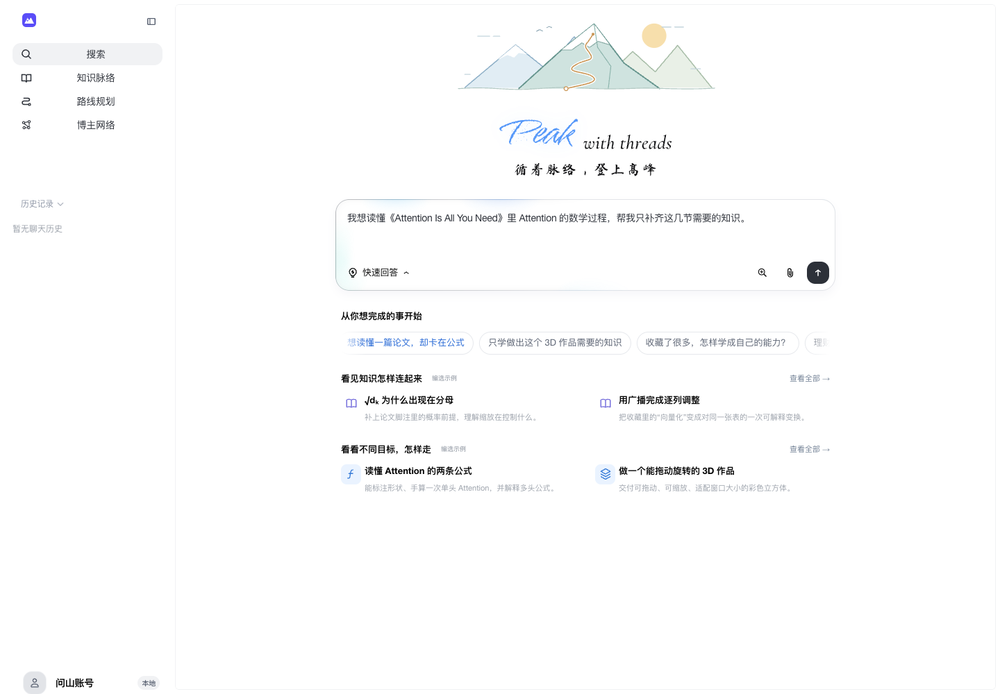

# 问山 · ThreadPeak

**从一个想完成的目标，走到一条能读、能问、能积累的学习路线。**

ThreadPeak 是一个 AI 辅助学习工作台。它把知乎内容、你提供的资料和持续对话串起来：先弄清楚要学到什么程度，再生成可探索的 3D 路线，让阅读与追问逐渐沉淀成有来源的知识卡片。

[快速开始](#快速开始) · [核心能力](#核心能力) · [开发](#开发) · [文档](docs/README.md) · [部署](deploy/README.md)



*首页编选示例。示例与个人生成内容分开保存。*

## 核心能力

- **围绕目标制定路线**：通过简短访谈明确成果、基础和限制。每个概念都有用途、学习深度和检验任务，路线支持顺序、分叉与汇合。
- **让学习过程可探索**：在 3D 场景中浏览路线、进入概念，再回到上次位置。推荐顺序不会锁住学习节点。
- **从资料长出知识**：文章、回答和追问组成单父卡片树；聊天、画布与文档共享内容，可以编辑、整理和继续提问。
- **控制本次学习的材料**：支持 PDF、Markdown、TXT，以及显式导入的知乎收藏夹和公开创作。可选择全知乎、全网或仅收藏夹范围。
- **找到问题背后的作者**：按问题检索公开文章和相关博主，保留来源关系与主题反馈，帮助准备请教。这里提供的是资料与线索，不代表作者本人在线回复。
- **中断后继续**：任务、检查点、对话和知识保存在服务端。刷新页面不取消生成；新对话保留已有文章和知识树。
- **统一阅读体验**：聊天、文章、卡片和文档共用 Markdown、代码与数学公式渲染，原始材料与编辑副本分开保存。

## 快速开始

需要 **Node.js 24+** 和 npm。默认使用本地 PGlite，无需先安装 PostgreSQL；生成路线和回答需要配置模型及知乎 API。

### 1. 获取项目

以下命令检出当前开发分支 `codex/investor-showcase`。

```sh
git clone --branch codex/investor-showcase https://github.com/XianMing-Wu/threadpeak.git
cd threadpeak
npm ci
cp .env.example .env
```

### 2. 配置服务

编辑 `.env`，填写以下生成服务配置；具体含义及可选账号设置见[配置指南](docs/configuration.md)。

```dotenv
DEEPSEEK_API_KEY=
DEEPSEEK_BASE_URL=
DEEPSEEK_MODEL_NAME=
DEEPSEEK_CONTEXT_TOKENS=
ZHIHU_ACCESS_SECRET=
ZHIHU_API_BASE_URL=
```

未配置 provider 时可以启动本地界面、查看编选示例，生成服务会明确报告未就绪。真实凭证只放在本地 `.env` 或部署环境中。

### 3. 启动

在一个终端启动 API：

```sh
npm run server
```

在另一个终端启动前端：

```sh
npm run dev
```

打开 **[localhost:4301](http://localhost:4301)**。API 默认监听 `127.0.0.1:4312`，前端通过同源代理访问它。

本地数据保存在 `server/.data/product-v2`。匿名工作区依靠浏览器 Cookie 找回身份；需要正式账号或多副本运行时，请使用[部署指南](deploy/README.md)中的 PostgreSQL 和身份配置。

## 开始一次学习

1. 在首页描述想完成的事，按需添加资料并选择检索范围。
2. 回答目标访谈，也可以直接填写自己的情况；当前题组答完后自动生成路线。
3. 打开路线中的概念，阅读收集的资料与首次讲解。
4. 从卡片发起追问，在画布或文档中整理；下次从历史或“我的”列表继续。

想先了解交互，可以浏览内置的论文、3D 作品、公开文章选集等[编选示例](docs/showcase.md)。知乎授权域还提供显式的[本地演示模式](docs/configuration.md#知乎账号与演示模式)，模型、搜索和 PDF 解析仍使用真实服务。

## 开发

前端使用 React、TypeScript 和 Vite；后端使用 Fastify、持久任务与 PostgreSQL/PGlite；共享数据合同使用 Zod。

```sh
npm run check       # 主项目与测试的类型检查
npm run lint        # 代码检查
npm test            # Node 行为测试与前端组合测试
npm run build       # 构建前端
```

覆盖率、PostgreSQL 验证、QA 页面和维护脚本见[开发指南](docs/development.md)。

```text
src/        页面、学习工作区、阅读与 3D 宿主
server/     持久工作流、provider、鉴权与存储
packages/   共享合同、API 客户端与运行时原语
docs/       当前产品、Agent 合同和工程指南
qa/         可复现的验收页面与证据
```

## 项目状态

当前处于持续开发阶段，已有本地模型调用、持久任务、数据库及浏览器集成验收。生产身份、规模化负载、长材料摘要质量和数据保留政策仍有待完成的工作，详见[现状与边界](docs/product.md#42-仍需实际验收或外部配置)。测试结果按具体版本记录在 [QA](qa/README.md) 中。

## 文档

| 想了解什么 | 从这里开始 |
| --- | --- |
| 配置模型、数据库与知乎账号 | [配置指南](docs/configuration.md) |
| 运行、测试与修改代码 | [开发指南](docs/development.md) |
| 部署、备份与运维 | [部署指南](deploy/README.md) |
| 产品目标、当前实现与缺口 | [产品说明](docs/product.md) |
| 工作流、存储与恢复机制 | [工程设计](docs/engineering.md) |
| Agent 输入、提示词和输出合同 | [Agent 合同](docs/agents.md) |
| 资源出处与第三方许可 | [资源来源](vendor/SOURCE.md) |

参与修改前，请阅读 [AGENTS.md](AGENTS.md)。历史设计与审查记录集中在[历史索引](docs/history.md)。
