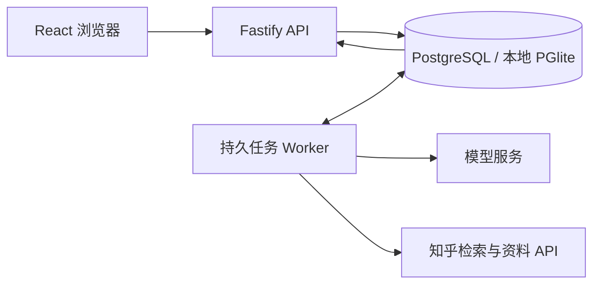

# 工程设计

本文记录活动实现的工程选择。产品行为以[产品说明](product.md)和 [Agent 合同](agents.md)为准；历史方案和单次验收通过[历史索引](history.md)追溯。

## 运行结构

唯一服务入口是 `server/main.ts` → `server/durable/bootstrap.ts`。固定流程由代码调度，模型负责当前步骤的受约束输出；不增加总控模型或独立 judge。MCP 是可选适配层，不是内部函数的强制包装。

## 数据与合同

- PostgreSQL 保存资源、任务、步骤检查点、事件、会话和作者关系；本地使用 PostgreSQL 兼容的 PGlite。
- 服务端拥有已生成事实。浏览器只保存草稿、偏好、示例编辑和可重建投影；旧记录只读保留用于恢复，不在路线页和知识页列出，不因 404 或解析失败删除。
- API 消费 `packages/contracts` 的公开出口与子路径。schema 校验、来源 ID 回查、所有者校验先于提交。
- 卡片为单父树；路线为支持分叉汇合的 DAG；作者网络保留多文章、多问题、多主题关系，三者不共用拓扑约束。
- `packages/runtime-store` 的 duplicate/late/gap 原语是独立库能力；当前产品使用 revision 快照轮询，未把内部事件诊断当作产品事件传输。

## 任务、事务与取消

请求先以所有者和幂等键持久接收，再由 worker 执行。成功步骤保存检查点，恢复只重做未完成步骤。外部调用可能重复，业务结果通过 fence 和事务避免重复提交；这不保证 provider 计费恰好一次。

route-direct-v6 的 path.start 将目录补查和访谈并行执行。题组可提前持久显示，答案通过 tp_path_answer_commands 的账号幂等回执在资源锁下保存，不因准备任务仍在运行而拒绝；准备上下文固定，新增答案仅用于最终规划。题目全答与 research.ready 在同一资源事务内汇合，结束准备任务并排入一次 path.answer；未全答的提交只保存答案，不排后台任务。并行进度更新始终基于最新资源，不能覆盖其间新增的答案；失败恢复复用成功目录和题组检查点。

任务租约 90 秒、每 5 秒续租；领取不消耗失败预算，自动执行累计 4 次失败后等待处理。异常过期接管独立计数，第 4 次转为 waiting；正常停机释放不计数，显式恢复清零接管计数。本进程领取排除自己尚持有的任务，handler 返回后必须已有完成、等待或取消状态。网络、超时和瞬时数据库错误可恢复，配置或鉴权错误保留为可诊断状态。手动恢复最多 4 次、间隔至少 30 秒，每次以独立时间记录计入账号窗口额度。

生成失败须区分传输、结构和内容质量。HTTP 200 且 JSON 通过 schema 后，不能因为缺少某个关键词而记为结构错误。R1 的学习选择和 R3 的条件题要求保留在当前 Agent 提示词中，程序不再用自然语言正则判断其是否合格。输出示例必须能通过对应 schema，避免示例数量或 ID 与校验相冲突。格式修复和临时服务恢复仍有界；持续不可用或配置问题不能靠隐藏失败、无限重试或发布虚构结果解决。

聊天、卡片和完成事件在同一事务发布。嵌套事务使用同一连接 savepoint，PostgreSQL 与 PGlite 共用回滚行为测试。流式草稿不是成功结果；正文检查点和引用关联检查点分开，关联重试不清空或重播已经生成的正文。

本进程取消立即触发 AbortSignal；跨副本由心跳发现。正常停机在同一关闭序列中先停止 worker、按 job/fence 交回队列，再关闭数据库，保留检查点和失败预算；迟到提交被拒绝。数据库失联时仍依靠租约恢复。

## 快照、版本与维护

快照用单条 MVCC 查询同时读资源与最新任务，不取资源行锁；写事务尚未提交时读者看到上一完整提交。事件写入在同一 SQL 中比较期望 revision、由数据库自增版本并插入事件；旧版本和事件序号冲突返回明确错误。业务写操作继续持锁保护组合变更。

任务快照在 SQL 中只读取界面所需字段，排除检查点和完整输入；资料库按 (updated_at,id) 游标每页最多 100 个资源，仅投影目录字段，客户端收齐后发布投影并防止账号切换时串入旧结果。作者来源在一次读取中建立节点、文章和原始段落索引，沿单父链复用结果；不跨资源版本缓存，删除与反馈撤销后重新读取。

dataRevision 只在正文改变时推进，前端共享未改变的集合；进度更新不重写正文。学习页以 afterData 请求正文增量，正文未变仍返回当前任务和草稿。同一阶段只更新草稿时不递增资源 revision、不插入事件；实际阶段变化仍记录事件。知识树是扁平节点数组和父 ID，图的高度不增加 JSON 嵌套深度。校验和布局使用迭代遍历；拖动偏移与基础布局分开，文档按前序列表显示。普通对话与学习页均条件轮询：运行中 1 秒、空闲 5 秒、隐藏 30 秒，聚焦或本地命令唤醒；不因隐藏页面取消任务。文字/颜色编辑只发送变更卡片及其观察版本，服务端仍做三方合并、完整树和来源校验；结构编辑保留完整排序。撤销/重做存变更卡片，结构操作保留前后排序，并合并期间新增内容。

维护独立于领取循环：首次延迟 60 秒，成功后一小时重跑，满批次一分钟后续跑，失败退避至多 15 分钟。删除每类最多 1000 条、压缩任务最多 100 条，锁超时 1 秒、语句超时 5 秒；错误记录安全类别。

历史遗留的过期直答缓存和超过 7 天的 provider/阶段日志由有界维护批次清理，请求路径不再扫描删除；来源摘要没有新增过期政策。

内部诊断事件保留 7 天；完成任务 30 天后压缩重复载荷，保留幂等回执和已发布资源，压缩任务不能重跑。等待/取消任务保留恢复材料。任务回执总量仍随命令增长，幂等有效期限、过期拒绝协议和删除政策属于未关闭的上线门槛。

## 并发、限流与缓存

所有知乎 API 共用同库两路额度，首次学习2–6项、问博主2–4项按两条一批搜索，前批收齐再发后批，不丢查询。发送间隔与并发分别控制；429 及 HTTP 200 中检索的业务限流均触发共享冷却并遵守 Retry-After。排队超时不会无限自动重新入队。响应解析、空正文、不完整输出、网络和超时保留独立错误码；有 HTTP 响应才记录 HTTP 状态，网络错误只保存允许的连接错误码，不保存原始错误正文或凭据。

HTTP 按 owner/IP 分桶，登录和公开入口先按 IP 限流；可信代理用显式白名单，IPv6 规范化到 /64。默认每桶 600 次/分钟，数据库原子计数，窗口与清理使用数据库时间，多副本和重启共用。计数存储故障时 API 返回 503；轻量 `/health` 独立于数据库。共享计数增加数据库写入，实际吞吐必须压测。

知乎检索保持network-first，直答适配器、调用、缓存读写均已移除；历史缓存表仅由既有维护清理。DeepSeek KV缓存由服务商处理，服务端只记录真实usage，未知不补零。

调用预算按实际LLM窗口与业务上限500,000的较小值，独立扣除输出和安全余量；长材料按来源压缩，目标、概念四项总结和当前问题保持原样。

ops:queue 读取近 24 小时 provider、上下文与工作流分段指标：耗时分位数、失败/缓存命中、块数和摘要调用数；有实际 usage 才汇总。嵌套阶段不相加。模型输出的结构质量和语义质量分别验收，人工质量账本见[审查修复记录](../qa/project-audit-fixes-2026-09-08.md)。

资料目录按游标每页 50 条元数据，正文只从单份详情读取。业务命令要求 8–200 字符的 Idempotency-Key；按固定资源/操作派生幂等身份的恢复、首次进入和展示接口沿用派生键。未配置生成 provider 时拒绝新生成请求，已有资源仍可读取。

上传使用独立 parser 作用域，收 body 前限制单实例最多 4 个、同账号最多 2 个上传；请求超时 120 秒。每账号默认最多 500 份资料、1 GiB 来源字节预算，可由 THREADPEAK_MATERIAL_MAX_COUNT/THREADPEAK_MATERIAL_MAX_BYTES 调整，游客与知乎账号使用相同预算。导入在创建时预留 8 MiB 文本预算，避免异步完成突破已分配额度；这些数值不是物理数据库空间上限或生产压测结论。游客入口每 IP 每小时最多 20 次，仍受全局窗口限制。PDF 远端上传检查点落库后删除对应原始上传副本；上传检查点前的失败/取消仍保留唯一恢复材料。

## 本地存储与所有权

显式 `POST /api/auth/guest` 创建或恢复 `guest:` 所有者；会话读取不再自动创建匿名工作区。活动 cookie 为服务端随机 256 位令牌，数据库仅存摘要；游客活动会话 30 天，独立恢复 cookie 90 天，选择游客登录时续期。恢复摘要带用途前缀，不能拿来直接访问业务 API；退出撤销活动会话，保留同浏览器恢复能力。两种 cookie 均 HttpOnly、SameSite=Lax，生产 Secure；入口先校验来源并按 IP 限流。旧 `local:` 会话在退出／进入游客时补恢复凭据，保留原 owner 和资料；生产不接受旧本地身份。清除浏览器 cookie 后无法凭空找回游客身份，用户可导出资料；跨设备恢复仍需账号身份。知乎与游客不自动合并。

`/api/v2/session` 发布 `kind`、`provider`、`capabilities.zhihuMaterials` 与不透明工作区标识；前端集中订阅，只有已连接知乎账号展示授权资料入口。隐藏 UI 之外，服务端在收藏读取、导入和路线仅收藏夹范围入口校验账号，不能使用开发者令牌替代游客授权。普通学习工作流共用现有持久任务、所有权、取消和重试合同。

PGlite 目录通过内核文件描述符锁限定一个持有者，进程退出后自动释放；锁文件保持稳定 inode。v2 协议不依赖 PID；旧活 PID/不明标记仍保守拒绝接管。只保证支持锁的本地文件系统，多副本使用 PostgreSQL。

账号切换先将草稿提交到 IndexedDB 再清旧键；恢复不下的内容保留 pending 元数据。UI 独立读取和订阅恢复状态，即使离线登录也能导出本机备份。两种备份存储都不可写时保留原字节并提供明确提示，不静默丢弃。

## 验证与参考

[QA 入口](../qa/README.md)区分离线行为测试、真实 PostgreSQL、真实 provider 和浏览器证据。[部署指南](../deploy/README.md)负责身份、备份和上线门槛。设计中的事务依据可查 [PostgreSQL 事务隔离](https://www.postgresql.org/docs/current/transaction-iso.html)，共享计数接口见 [Fastify rate-limit](https://github.com/fastify/fastify-rate-limit#custom-store)，目录锁接口见 [fs-native-extensions](https://github.com/holepunchto/fs-native-extensions)。

3D renderer、Coverflow 和图标的来源/同步要求见 [vendor/SOURCE.md](../vendor/SOURCE.md)，品牌字体许可见[品牌说明](../src/ui/brand/README.md)。运行时不通过兄弟项目路径读取依赖。
