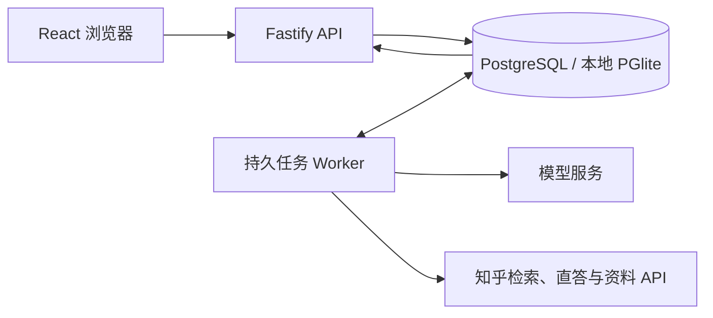

# 工程设计

本文记录活动实现的工程选择。产品行为以[产品说明](product.md)和 [Agent 合同](agents.md)为准；历史方案和单次验收通过[历史索引](history.md)追溯。

## 运行结构

唯一服务入口是 `server/main.ts` → `server/durable/bootstrap.ts`。固定流程由代码调度，模型负责当前步骤的受约束输出；不增加总控模型或独立 judge。MCP 是可选适配层，不是内部函数的强制包装。

## 数据与合同

- PostgreSQL 保存资源、任务、步骤检查点、事件、会话和作者关系；本地使用 PostgreSQL 兼容的 PGlite。
- 服务端拥有已生成事实。浏览器只保存草稿、偏好、示例编辑和可重建投影；旧记录只读归档，不因 404 或解析失败删除。
- API 消费 `packages/contracts` 的公开出口与子路径。schema 校验、来源 ID 回查、所有者校验先于提交。
- 卡片为单父树；路线为支持分叉汇合的 DAG；作者网络保留多文章、多问题、多主题关系，三者不共用拓扑约束。
- `packages/runtime-store` 的 duplicate/late/gap 原语是独立库能力；当前产品使用 revision 快照轮询，未把内部事件诊断当作产品事件传输。

## 任务、事务与取消

请求先以所有者和幂等键持久接收，再由 worker 执行。成功步骤保存检查点，恢复只重做未完成步骤。外部调用可能重复，业务结果通过 fence 和事务避免重复提交；这不保证 provider 计费恰好一次。

任务租约 90 秒、每 5 秒续租；领取不消耗失败预算，自动执行累计 4 次失败后等待处理。网络、超时和瞬时数据库错误可恢复，配置或鉴权错误保留为可诊断状态。手动恢复最多 4 次、间隔至少 30 秒，每次以独立时间记录计入账号窗口额度。

聊天、卡片和完成事件在同一事务发布。嵌套事务使用同一连接 savepoint，PostgreSQL 与 PGlite 共用回滚行为测试。流式草稿不是成功结果；正文检查点和引用关联检查点分开，关联重试不清空或重播已经生成的正文。

本进程取消立即触发 AbortSignal；跨副本由心跳发现。正常停机按 job/fence 交回队列，保留检查点和失败预算；迟到提交被拒绝。数据库失联时仍依靠租约恢复。

## 快照、版本与维护

快照用单条 MVCC 查询同时读资源与最新任务，不取资源行锁；写事务尚未提交时读者看到上一完整提交。事件写入在同一 SQL 中比较期望 revision、由数据库自增版本并插入事件；旧版本和事件序号冲突返回明确错误。业务写操作继续持锁保护组合变更。

dataRevision 只在正文改变时推进，前端共享未改变的集合；进度更新不重写正文。知识树是扁平节点数组和父 ID，图的高度不增加 JSON 嵌套深度。

维护独立于领取循环：首次延迟 60 秒，成功后一小时重跑，满批次一分钟后续跑，失败退避至多 15 分钟。删除每类最多 1000 条、压缩任务最多 100 条，锁超时 1 秒、语句超时 5 秒；错误记录安全类别。

内部诊断事件保留 7 天；完成任务 30 天后压缩重复载荷，保留幂等回执和已发布资源，压缩任务不能重跑。等待/取消任务保留恢复材料。任务回执总量仍随命令增长，幂等有效期限、过期拒绝协议和删除政策属于未关闭的上线门槛。

## 并发、限流与缓存

所有知乎 API 共用同库两路额度，第三项排队，不能删掉第三种问法或讲解角度。发送间隔与并发分别控制；429 触发共享冷却并遵守 Retry-After。排队超时不会无限自动重新入队。

HTTP 按 owner/IP 分桶，登录和公开入口先按 IP 限流；可信代理用显式白名单，IPv6 规范化到 /64。默认每桶 600 次/分钟，数据库原子计数，窗口与清理使用数据库时间，多副本和重启共用。计数存储故障时 API 返回 503；轻量 `/health` 独立于数据库。共享计数增加数据库写入，实际吞吐必须压测。

知乎完整成功直答按账号、端点/凭据命名空间、模型、全部上下文、深度与版本精确缓存 24 小时；同键并发合并，取消/错误/截断不缓存，检索保持 network-first。DeepSeek KV 缓存复用稳定前缀，服务端仅记录真实 usage，未知命中量不补零，也不承诺每次命中。

调用预算按实际 provider 窗口扣除输出和余量。用户目标、真实回答、当前问题、引用 ID 与版本不压缩；来源全量分块摘要，只改调用副本，原文保留，不截 JSON 或用原文前缀冒充摘要。

## 本地存储与所有权

PGlite 目录通过内核文件描述符锁限定一个持有者，进程退出后自动释放；锁文件保持稳定 inode。v2 协议不依赖 PID；旧活 PID/不明标记仍保守拒绝接管。只保证支持锁的本地文件系统，多副本使用 PostgreSQL。

账号切换先将草稿提交到 IndexedDB 再清旧键；恢复不下的内容保留 pending 元数据。UI 独立读取和订阅恢复状态，即使离线登录也能导出本机备份。两种备份存储都不可写时保留原字节并提供明确提示，不静默丢弃。

## 验证与参考

[QA 入口](../qa/README.md)区分离线行为测试、真实 PostgreSQL、真实 provider 和浏览器证据。[部署指南](../deploy/README.md)负责身份、备份和上线门槛。设计中的事务依据可查 [PostgreSQL 事务隔离](https://www.postgresql.org/docs/current/transaction-iso.html)，共享计数接口见 [Fastify rate-limit](https://github.com/fastify/fastify-rate-limit#custom-store)，目录锁接口见 [fs-native-extensions](https://github.com/holepunchto/fs-native-extensions)。

3D renderer、Coverflow 和图标的来源/同步要求见 [vendor/SOURCE.md](../vendor/SOURCE.md)，品牌字体许可见[品牌说明](../src/ui/brand/README.md)。运行时不通过兄弟项目路径读取依赖。
