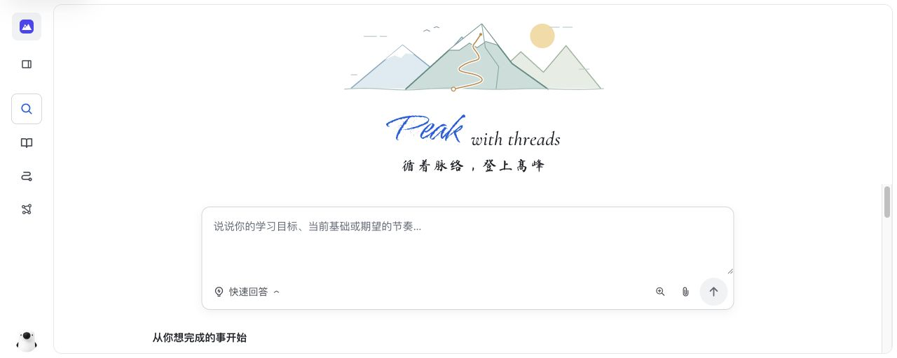
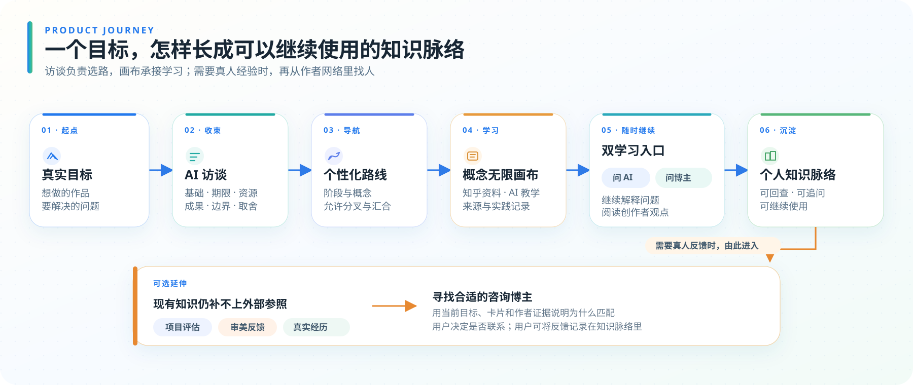
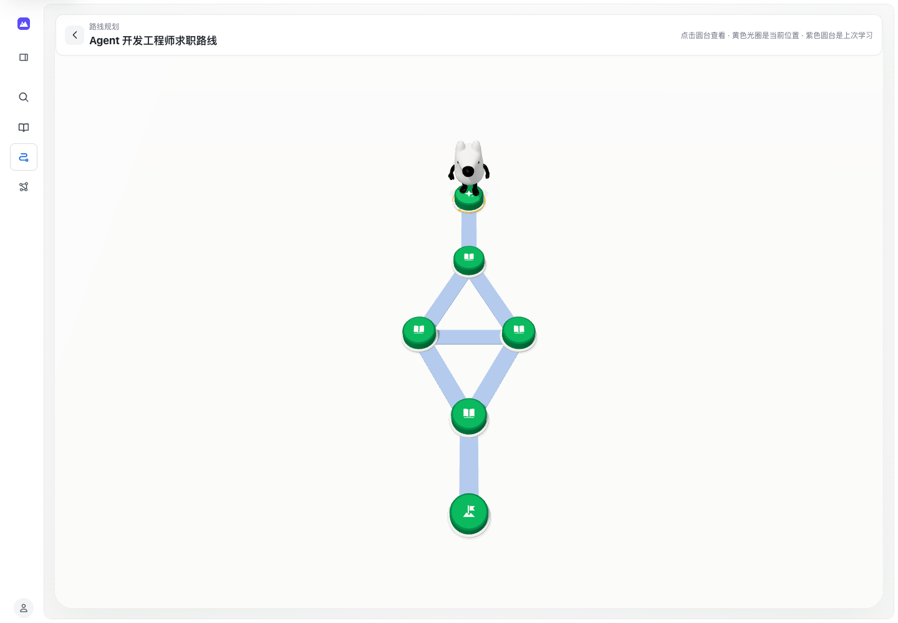
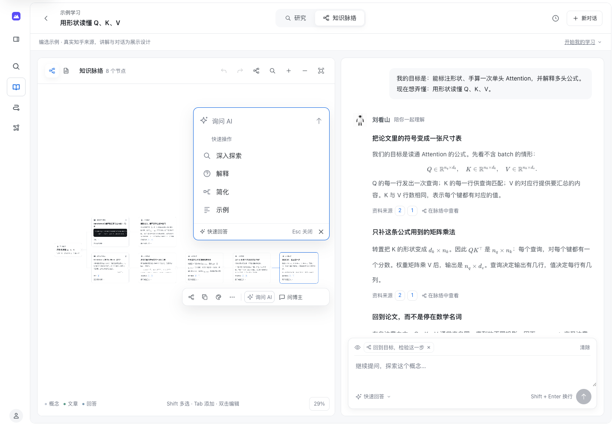
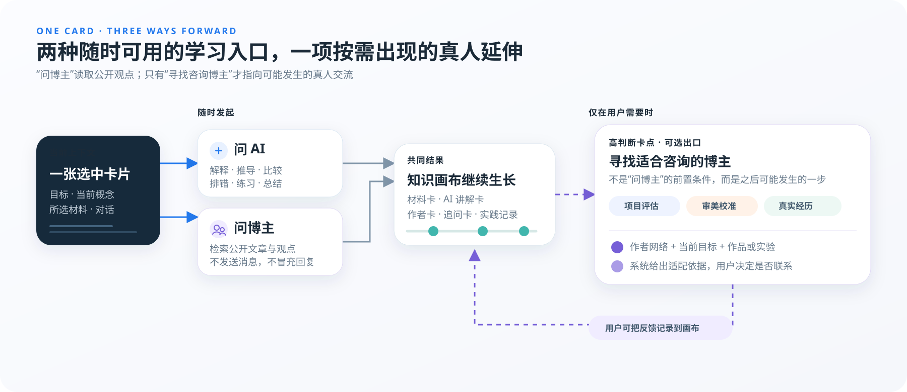
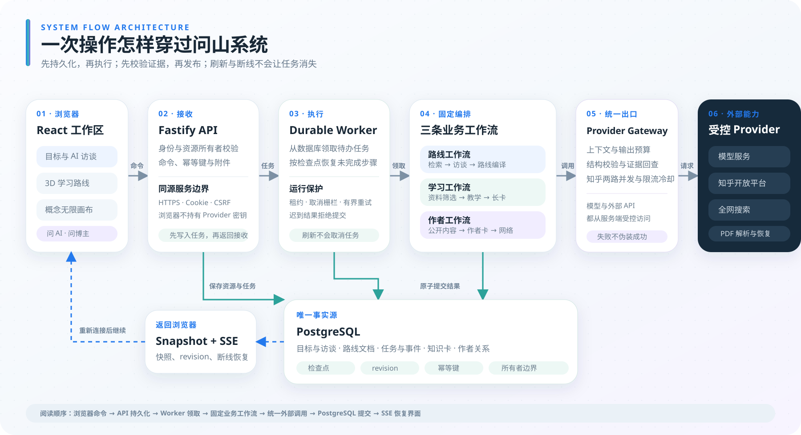

# 问山 ThreadPeak｜产品说明计划书

> 从真实目标出发，走出属于自己的知识脉络。

### 写在前面

最早做问山时，我也想过把它收得更小。只做路线生成，产品会很好解释；只做知识画布，也足以成为一个独立工具。可我把自己的学习过程重新走了一遍，发现问题总是出在功能之间的缝隙里。一个想法生成了路线，路线却没有接住后面的阅读。资料看了很多，提问和笔记又散落在不同地方。等到真正做出作品或项目后，用户还会遇到一些仅靠资料和 AI 难以解决的问题：项目质量需要有经验的人评估，作品的审美需要具体反馈，有些选择也需要参考真人的亲身经历。

我知道访谈、路线、检索、画布、问 AI、问博主和作者网络放在一起，会让产品看上去比单点工具复杂。保留这些功能，是因为它们都在接住学习流程中的一次断裂，并且围绕同一个目标工作。问山关注的是完整过程：用户从一个念头出发，经过选路、学习和实践，必要时继续向外求证，最后留下真正属于自己的知识脉络。

仅靠一份文字计划书，很难让人马上看清这些功能怎样接在一起。为了方便评委老师和体验者理解产品理念，我专门做了一个可以交互的产品页。大家可以沿着真实操作顺序，查看目标怎样经过访谈变成路线，以及进入概念后，资料、AI 讲解和新的提问怎样留在同一张画布上。演示视频也按关键步骤做了详细标注，画面进行到哪里、系统正在处理什么，都可以直接对照。下面的说明沿着同样的顺序展开，再介绍问山为什么适合知乎，以及这些流程怎样落到技术实现中。

### 创作思路

人们开始学习，通常不是为了完成一张知识清单，而是手头真的有一件事要做：“我想做出一个可靠的大模型应用”、“我想让作品更有表达”或“我正在面对一个会影响未来几年的选择”。搜索能给出许多答案，难处在于这些答案往往通向不同方向。用户需要知道，哪一条路适合自己的基础、时间、资源和现实处境。

问山是一款面向知乎社区、以个人知识脉络为中心的**目标驱动 AI 学习工作区**。用户先说想做成什么，访谈再确认已有基础、现实限制和完成标准。系统结合知乎的多元回答、用户授权资料与公开内容，分辨不同建议分别适合什么条件，最后收束出一条适合当前用户的路线。

一次学习中的目标、路线、资料、提问和实践都会留在同一条知识脉络里。访谈确认最终成果，路线安排需要经过的概念，知乎资料与 AI 教学承接具体学习；遇到新问题时，用户可以从当前卡片继续“问 AI”或“问博主”，不必重新交代上下文。

*首页先让用户说清想完成什么。系统根据已知信息，只追问会影响路线的未知条件，再生成路线。*

#### 核心体验：从一个想法，长出自己的知识脉络

**想法与材料 → AI 访谈 → 个性化路线 → 概念无限画布 → 知乎资料与 AI 教学 → 问 AI / 问博主 → 个人知识脉络**

*问 AI 和问博主都属于日常学习。需要作品评估、审美把关或亲历经验等真人反馈时，用户还可以主动寻找适合请教的人。*

| 阶段 | 用户实际获得什么 | 与知识脉络的关系 |
| --- | --- | --- |
| 提出想法 | 可以只说想做什么、想解决什么，也可以附上 PDF、Markdown、文本或授权的知乎收藏与创作 | 原始目标成为整条脉络始终保留的方向，不必先翻译成课程名称 |
| AI 访谈 | 系统继续确认最终成果、已有基础、期限、资源与不想扩张的范围 | 从多条都可能正确的路径中找出当前用户真正需要的一条，避免知识越学越多却离目标越来越远 |
| 生成路线 | 形成可分叉、可汇合的 3D 学习路线，每个概念都说明为什么学、学到哪里以及怎样检验 | 路线是知识脉络的导航骨架，决定哪些概念值得进入，但不会提前伪造用户尚未学习的知识 |
| 进入概念 | 系统围绕目标与当前概念检索知乎资料，筛选互补文章，再由 AI 写成连续、带来源的教学 | 文章成为材料卡，AI 讲解成为知识卡，实际学习内容开始在无限画布中生长 |
| 继续追问 | 用户可以在任意材料卡或知识卡上“问 AI”，也可以随时“问博主”，查看知乎创作者围绕当前问题发表过的公开内容与不同观点 | 两种提问都继承当前目标、概念、材料和已学上下文，并从所选卡片后继续长出新卡 |
| 真人咨询（可选） | 当用户遇到仅靠现有知识和 AI 难以完成的项目评估、审美校准或真实经历问题时，可以进一步寻找适合咨询的博主 | 系统利用已经积累的作者网络与当前问题补充匹配依据，是否联系始终由用户决定 |
| 长期积累 | 新对话不会清掉已经形成的文章、知识卡、实践记录与作者关系 | 一次路线逐渐变成可回看、可追问、可继续使用的个人知识资产 |

访谈和路线不是做完就丢掉的前置步骤。它们一直回答两个问题：这次学习要通向什么成果，接下来为什么要学这个概念。进入无限画布后，“问 AI”会结合当前材料继续解释，“问博主”会查找知乎创作者已经公开表达过的观点。只有用户需要真人评估或亲历信息时，产品才会进一步用作者网络寻找咨询对象。

#### 一个完整例子：从“学习大模型”到可验证的知识库助手

一位会 Python 和基础机器学习的学生提出“我想系统学习大模型”。这个目标可能通向模型原理、预训练与微调、应用开发、Agent，或者大模型评测。问山不会立刻生成一张通用课程表，而是通过访谈确认：他没有训练基础模型的算力，两个月后的成果是一个课程知识库助手和一份评测报告，希望理解必要原理，但主要目标是把应用做出来并证明它可靠。

路线于是保留理解应用所需的注意力机制、上下文窗口和嵌入原理，主线进入文档解析、检索与重排、RAG 生成、引用回查、评测集设计和错误分类。每个概念都与最终成果相连：学习嵌入，是为了理解资料为什么能被召回；学习引用忠实度，是为了判断回答是否真正被原文支持；学习错误分类，是为了知道下一轮应该改检索、提示词还是资料本身。

*示例路线可以分叉、汇合。每个节点都对应一次具体的学习或验证任务。*

当用户进入“RAG 引用忠实度”概念，系统结合原始目标、访谈结果、路线位置与概念边界生成 2–6 项查询，两条一批检索知乎内容，再从候选中筛选能够互相补充的文章。文章先成为可直接阅读的材料卡，AI 随后围绕同一个例子写出连续讲解，并把每段内容连接到它真正依据的材料。此时用户看到的不再是一串搜索结果，而是一块已经开始生长的知识画布。

*知识画布保留文章、AI 讲解和追问之间的连接。选中卡片后，可以直接问 AI 或问博主；右侧仍能阅读正文和继续对话。截图使用示例数据。*

如果用户仍不理解“为什么检索命中了正确段落，回答却可能没有忠实引用”，他可以选中对应文章或 AI 讲解卡继续“问 AI”。新回答保留当前目标和选中材料，从原卡后长出新的解释、对照和练习，而不是开启一个失去上下文的新聊天。随着用户持续追问，概念根、文章卡、AI 教学卡、追问卡与实践记录共同形成可追溯的个人知识脉络。

用户不必等到项目完成才“问博主”。在理解嵌入、检索、引用或评测的任何阶段，他都可以从当前卡片发起问题，让系统寻找知乎创作者围绕这个具体问题发表过的公开内容。相关作者、文章、观点与适用边界会成为新的卡片，并逐渐形成作者网络。**这里的“问博主”与“问 AI”一样，是随时可用的学习方式；它表示从公开内容中寻找人的观点，不等于已经向真人发出咨询。**

当项目已经有了评测集和失败样本，如果用户仍无法判断它是否达到真实业务的质量门槛，并希望得到生产经验更丰富的外部评估，才会进入下一步：根据当前问题、已有作者网络和补充搜索，寻找更适合进一步咨询的创作者。系统可以整理推荐依据、能力边界和可编辑的请教草稿，但是否联系、联系谁以及是否采纳建议，始终由用户决定。

#### 同一套学习方法，怎样适应不同目标

大模型案例展示了一次完整过程：访谈先把宽泛目标问清楚，路线再把目标拆成概念和验证任务。进入具体概念后，知乎资料、AI 讲解、创作者的公开观点、用户的实验和追问都会留在画布里。学习越深入，这些内容越能成为后续分析和实践的依据。

这套过程并不只服务技术学习。目标换成一组摄影作品、一次空间改造，或一项理财与职业选择后，访谈仍然从“要完成什么”开始，再结合已有基础与现实限制选择路线。变化的是学习内容，不变的是目标、知识与实践始终放在同一条脉络里。

**先把“想学”问成“要做成什么”。** 同样是学习摄影，有人需要补曝光与用光，有人想建立纪实叙事，也有人只是想把一次旅行拍得更有表达；同样是学习理财，有人需要理解资产配置，有人真正面对的是三年内买房和现金流安全。访谈改变的是路线的目的、取舍和终点。路线确定后，资料、讲解、追问和实践才围绕同一个目标进入画布。

**路线定下来，知识才开始落到方案、作品和项目里。** AI 会继续解释概念、组织来源、比较方法、拆解案例和设计练习。补一个概念、分析一次失败、比较两种方法，或者根据结果调整下一轮实验，都可以留在这条学习链路中处理，无需默认转向真人咨询。

有些卡点需要的不是再补一条知识，而是**现有材料之外的参照**。RAG 的离线指标已经达标，用户可能仍想请有生产经验的人检查评测集是否漏掉了真实业务中的模糊提问；摄影者掌握了构图和调色原则，也可能需要创作者针对具体作品判断视觉表达是否成立；不同财务方案都算清楚后，用户还可能想了解相似处境的人几年后实际遇到了什么。这时 AI 仍可整理证据、检查假设并准备问题，外部评估、作品感受和亲历信息则要从合适的人那里获得。

**真人咨询不是下一步默认动作。** “问博主”在任何学习节点都可以发起，它读取的是创作者已经公开的内容。只有用户碰到上述卡点，并且明确想获得真人评估、作品反馈或亲历信息时，问山才会结合当前目标、路线、材料、方案和已有作者网络，继续寻找更匹配的创作者。系统说明推荐依据与能力边界，并准备可编辑的请教内容；联系谁、是否联系和怎样采用反馈，都由用户决定。新的观点还可以回到原来的知识脉络中，供 AI 帮助比较和消化。

| 目标类型 | 用户可能提出的目标 | 访谈怎样收束路线 | 知识脉络怎样推进 | 什么情况下可进一步寻找咨询对象 |
| --- | --- | --- | --- | --- |
| 大模型与项目实践 | 模型选型、RAG 可靠性、Agent 上线、微调效果、AI 编程项目验收 | 从“学习大模型”继续确认真实任务、交付标准、成本、延迟、权限与错误后果，区分原理研究、应用开发与项目评测等路径 | 围绕必要原理、资料、评测集、指标、失败样本、对照实验和回归结果形成材料卡、讲解卡、追问卡与实践记录 | 当实验和指标已经完整，用户仍无法确认样本是否贴近业务、是否遗漏生产风险时，可寻找具有模型评测或上线经验的创作者帮助校准 |
| 摄影、设计与审美实践 | 纪实组照、人像与旅行摄影、电影感调色、界面设计、视频剪辑、小户型空间 | 从“学会工具”继续确认作品类型、受众、表达目的、使用场景和交付标准，区分技术训练、风格探索与真实创作等路径 | 围绕视觉原则、经典案例、作品拆解、练习标准和修改记录持续积累，让每一次创作都能回到具体依据 | 当用户已经掌握方法并完成作品，却仍难以判断视觉重心、节奏、气质、分寸与表达是否成立时，可寻找相应领域的创作者进行具体作品评议 |
| 理财、升学与人生选择 | 提前还贷还是投资、租房还是买房、定投回撤、读研还是工作、稳定岗位还是转行 | 把宽泛问题还原为期限、现金流、能力缺口、家庭责任、风险底线和真正想得到的结果，避免把不同处境压成同一份答案 | 围绕基础概念、方案比较、情景推演、公开案例与待核实问题建立决策依据，先帮助用户看清选择条件与代价 | 当方案与风险已经梳理清楚，用户还希望了解相似处境下长期变化、失败和隐性成本时，可寻找亲历者补充现实参照，而不是替用户作决定 |

项目评估、审美反馈和真实经历并不是三个独立入口，更不是每位用户的必经阶段。“问 AI”和“问博主”一直留在画布上，作者网络也会随着公开内容的阅读逐渐积累。只有当现有学习仍缺少生产现场的标准、对具体作品的感受或第一手经历，而且用户愿意继续求证时，产品才从作者网络中寻找合适的咨询对象。

#### “问 AI”“问博主”与真人咨询：两个日常入口，一项可选延伸

*问 AI 负责继续解释，问博主查找创作者的公开观点。需要真人反馈时，系统再从作者网络中找合适的人。*

| 能力 | 何时可以使用 | 系统怎样处理 | 结果如何进入知识脉络 |
| --- | --- | --- | --- |
| 问 AI | 学习过程中的任意节点 | 携带原始目标、访谈结果、当前路线与概念、所选卡片和当前对话，生成概念解释、原因分析、方法比较、排错、练习或阶段总结 | 回答按段落生成知识卡，每张卡都连接到真实材料卡或已有知识卡，便于继续追问和回查 |
| 问博主 | 与问 AI 一样，可在学习过程中的任意节点发起 | 围绕当前问题检索知乎公开内容，从真实候选中选择相对适配的作者及其观点，说明能覆盖什么、不能确认什么；这一步不发送消息 | 作者及其公开内容成为独立卡片，并进入作者关系网络，供后续阅读、比较和再次提问 |
| 寻找咨询博主（可选） | 用户遇到项目评估、审美校准或真实经历问题，并主动希望进一步获得真人反馈时 | 结合当前知识脉络、已有作者网络与补充证据，匹配更适合咨询的创作者，并生成可编辑的请教准备 | 咨询候选及来源与当前问题关联；用户可自行记录后续反馈，系统不会自动获取站外对话；是否联系与是否采纳始终由用户决定 |

“问博主”返回的是可核实的公开内容，不会把文章写成作者刚刚给出的回复；“寻找咨询博主”也不代表已经建立联系。真人同样不天然正确，个体经历也不能直接复制给另一个人。问山会继续用 AI 梳理公开证据、比较观点的成立条件、保留未知边界，并帮助用户理解真人反馈，而不是把判断权简单交给某一位博主。系统不会自动私信，也不会虚构作者意愿、服务状态或解决能力。

产品用“登山”来解释整个学习过程：目标是想抵达的山峰，访谈用来选路，知乎内容是一路能够回查的路标，无限画布则保存用户真正学过、问过和做过的事情。需要外部视角时，合适的创作者可以加入这段路；下次回来，用户仍能从已经走到的位置继续。

### 使用方式

- **提出想法**：说出想做成的作品、想解决的问题或正在面对的需求，不必先把它翻译成课程名称。
- **导入材料**：可上传 PDF、Markdown 或文本，也可在授权后选择知乎收藏夹与公开创作；游客仍可使用公开搜索和文件材料。
- **访谈选择路线**：通过成果、基础、期限、资源和边界问题，分辨不同学习路径通向的目的地；每题既有建议，也允许用户输入自己的真实答案。
- **生成学习路线**：把最适合当前用户的道路组织为阶段、载体、概念和前后关系，并用 3D 视图呈现允许分叉与汇合的路线。
- **进入无限画布**：每个概念都有独立画布，真实文章先成为材料卡；AI 教学、追问、笔记和实践记录从这些材料后继续生长。
- **问 AI**：从选中的文章卡或知识卡发起问题，让解释保留当前目标、概念和材料上下文，不覆盖原文。
- **问博主**：与问 AI 一样，可以随时从选中的卡片发起；系统依据当前问题检索知乎公开内容，让不同创作者的观点和适用边界进入知识脉络，这一步不等于联系真人。
- **寻找咨询博主**：当用户进一步需要项目评估、审美校准、决策参照或真实经历时，可以利用已有作者网络和当前学习上下文寻找更适配的创作者，并准备可编辑的请教草稿。
- **持续积累**：新对话会归档旧聊天，但保留文章、知识树、实践足迹和作者关系，让下一次学习从已经走过的位置继续。

### 适用人群

| 人群 | 常见需求 | 问山提供的帮助 |
| --- | --- | --- |
| 大模型与智能应用实践者 | 原理、训练、应用和评测路线庞大，系统做出来后也难以证明可靠 | 根据成果裁剪必要理论与工程路线，并在项目评估处连接模型工程师和研究者 |
| 摄影、设计与影像创作者 | 理论和技法已经掌握，却难以判断作品的审美、节奏与表达 | 用目标路线连接理论和实践，并在审美取舍处寻找具有公开作品与创作经验的真人 |
| 理财与家庭规划学习者 | 面对许多策略，不知道哪一种适合自己的期限、责任和风险处境 | 先学习现金流、风险与资产配置，再通过真实经历理解选择的代价；产品不替用户作投资决定 |
| 面临升学、职业或居住选择的人 | 公开信息很多，但难以把机会成本、个人条件和选择后的生活放在一起理解 | 用访谈还原真实约束，比较不同路径，并连接处境相近的亲历者获得有边界的决策参照 |
| 学生与跨专业学习者 | 面对不同教程和观点，不知道哪些基础与当前目标真正相关 | 结合已有基础和完成标准选择路线，减少重复学习和无关扩张 |
| 论文与复杂资料读者 | PDF、公式和术语密集，阅读容易中断 | 将资料放回概念画布，逐块讲解并保留来源、公式和上下文 |
| 知乎收藏用户 | 收藏了许多优质回答，却很少真正使用 | 按当前目标重新筛选收藏，让旧内容进入学习、追问和实践闭环 |
| 知乎专业创作者 | 希望旧内容持续产生价值，并获得更高质量的交流 | 让创作者因具体文章和具体问题被发现，获得背景完整、边界清楚的潜在请教 |

### 对知乎社区与产品的价值

知乎最珍贵的不只是文本数量，而是不同的人把知识、经验、判断和代价放在同一个问题里。面对“怎样证明大模型应用真的可靠”“怎样让一个作品形成自己的表达”“怎样在升学、职业、居住或理财方案之间选择”，研究者、创作者、从业者和亲历者会从完全不同的条件出发给出答案。问山不会把这些差异压缩成一个“平均答案”，而是通过访谈判断不同经验分别适合什么目标，让多元回答成为个人路线的原材料。

问山首先把知乎内容带回学习主流程。路线生成阶段使用知乎搜索发现不同学习方法、载体和适用条件；概念学习阶段再次围绕当前目标筛选能够互补讲解的文章；授权用户还可以把收藏夹和公开创作带入自己的路线。模型负责组织和教学，但文章标题、作者、摘要与原文链接始终保留，重要内容可以回到实际来源，而不是被压成一段看不见出处的 AI 总结。

对用户而言，收藏不再只是静态列表，搜索也不再止于读完一篇回答：资料会进入路线、概念画布、AI 教学、追问和实践，逐渐转化为可追溯的个人知识资产。对创作者而言，内容的价值首先来自被准确找到、被真正阅读、被带入具体学习目标并持续引用；在此基础上，一篇关于 RAG 失败案例、界面评审、组照编辑、职业转折或长期投资经历的旧回答，才可能进一步带来背景完整、问题具体的真实交流。

#### 商业价值：用户为什么愿意持续使用

个人版本的付费点来自持续学习。一次路线生成很快就会结束，真正花时间的是后面的资料阅读、连续追问、实践修改和项目复盘。用户可以为更深入的路线规划、更多资料处理额度、长期保存的知识脉络以及跨项目复用付费。比如，一个做完课程知识库助手的用户，下次开始模型选型或 Agent 项目时，可以直接带上已经学过的概念、评测方法和失败记录，不必重新整理一遍。这样的能力适合进入知乎会员或职业学习的增值权益，也可以按月或按项目提供；具体形式仍要通过真实用户的使用频率和付费意愿来决定。

创作者服务建立在公开内容已经被阅读的基础上。创作者的一篇旧回答可能先被选入路线，随后成为 AI 讲解和用户追问的依据。当用户已经有了明确问题、作品或实验结果，还希望获得外部反馈时，可以进一步邀请回答，或申请付费的系统评测、技术评审、作品点评与专业咨询。创作者能够看到问题背景与用户做过的尝试，省去反复追问基础信息的时间。若这一方向进入正式运营，需要由知乎提供清晰的自愿参与机制，管理擅长领域、服务范围、价格、隐私和争议处理；平台可以从服务分成或配套工具中获得收入。

学校、训练营和企业学习团队也可以使用同一套结构。课程负责人把知乎公开内容、获得授权的资料与内部文档放进一个目标学习空间，再按照最终作业或岗位任务生成路线。学习者在各自的画布里阅读、提问和提交实践记录，教师则能看到大家卡在哪些概念，以及哪些资料真正被使用。机构侧可以按席位或学习空间收费，实际落地前还要验证资料权限、管理成本和采购周期。

对知乎来说，这些收入并不只依赖用户多看一次页面。一篇已经发布数年的回答，可以因为新的学习目标再次被找到，并继续进入路线、讲解和项目实践。用户在知乎内容上投入的时间更长，创作者也更容易遇到问题具体、准备充分的读者。会员权益、职业学习和创作者服务因此有机会由三个分散入口，接到同一段学习过程里。

这里描述的是后续需要验证的商业路径，**不是当前已经上线的收费能力**。个人用户究竟愿意为什么付费、创作者是否愿意提供服务、平台怎样保证质量，都要通过小范围试用和真实交易继续确认。当前产品先验证一件更基础的事：目标、路线、知识画布和作者网络能否形成一段用户愿意持续使用的学习过程。

### 整体架构及技术方案

问山的技术结构沿着一次真实学习展开。系统先保存目标和访谈回答，再生成路线；用户进入概念后才检索资料、建立知识脉络。“问 AI”和“问博主”都从当前卡片继续，任务进度与结果可以在刷新后恢复。各个 Agent 按当前步骤读取本账号的目标与必要上下文；选卡范围、材料版本和当前对话边界贯穿学习，不读取其他账号的历史。

*读图顺序与一次请求相同：浏览器提交命令，服务端保存任务，Worker 执行工作流，结果写入 PostgreSQL，再通过 SSE 回到页面。*

#### 1. 一个目标上下文贯穿全程

用户第一次输入目标时，服务端便在独立的路线任务中保存目标上下文，保存目标原话、访谈中的真实回答、最终成果、限制条件以及仍然未知的问题。路线发布后，每个概念还会保存四项教学摘要：本节要解决什么、学到什么边界、怎样连接前后路线、与用户材料有什么关系。

这份目标上下文不是路线生成完成后就被丢弃。它会继续进入概念资料检索、文章筛选、首次 AI 教学、后续“问 AI”和“问博主”。因此，同一个“RAG”概念面对“理解论文原理”和“做出课程知识库”两个目标时，会使用不同的解释深度、案例和检验任务；用户在后面追问时，也不需要重新讲一遍自己为什么学习它。

#### 2. AI 访谈与路线生成：确定知识脉络的骨架

路线生成由服务端执行固定流程，而不是让一个通用 Agent 一次性自由发挥：

1. 根据目标与材料规划 4–5 个互补问题，分别寻找不同学习方式、载体、顺序、适用条件与真实经验。
2. 将问题合为两路完成首轮检索，打开可能的路径空间。
3. 只提取确实需要补查目录的书籍、课程或教程名称，最多 4 个；没有真实缺口时可为空；每个名称单独检索，两条一批。
4. 目录补查与 2–4 道 AI 访谈题并行进行。用户可以提前回答，每题提供三个建议和独立自定义输入。
5. 当资料与回答都准备完成，最终规划结合目标原话、全部真实回答和检索总结，生成阶段、载体、概念及每个概念的教学边界。
6. 程序再生成稳定标识、依赖关系、起点和终点，完成结构与 3D 文档校验后发布。

最终路线是一张允许分叉与汇合的 **DAG**，用于回答“先学什么、哪些内容可以并行、怎样抵达成果”。它不会在用户尚未学习时提前创建知识卡；它为后续知识脉络提供有目标、有边界的导航骨架。

#### 3. 概念学习：知识脉络真正开始生长

用户进入路线中的任一概念后，前端打开该概念的无限画布。系统读取原始目标、访谈结果、路线位置、概念四项教学摘要和本路线材料，生成 2–6 项互补查询，两条一批完成知乎或全网检索。候选收齐后，模型逐条阅读实际摘要，通常选择 3–6 篇、最多 8 篇真正服务当前概念的材料；只使用收藏夹时则不调用外部搜索，只从用户明确选择的资料中筛选。

入选文章先保存为可独立阅读的**材料卡**，即使后续 AI 教学生成失败，已有来源仍然可读。系统先从本次候选中选择最多 4 张必要依据，再由 AI 以老师身份将资料组织成一篇连续教学：围绕同一个例子逐步讲清问题、关键操作、原因、检验方法和适用边界，而不是逐篇拼接摘要。正文按 H2 分块，每一块都显示真实来源。

知识结构采用**单父树**：概念是根，文章与路线资料是一级材料卡，AI 教学和后续回答从某一张卡继续生长。每段 AI 内容只选择一个直接依据，服务端回查该材料中的证据片段，再把聊天回复和知识卡放在同一事务中发布。这样既能形成清晰的知识脉络，也能让用户随时回答“这段内容依据什么”。

#### 4. “问 AI”与“问博主”：都可以从当前卡片随时发起

“问 AI”是概念学习中的高频主分支。用户选中一张文章卡或知识卡提问，系统保留原始目标、当前概念、所选材料和本轮对话；默认全部或显式多选也先筛到最多 4 张回答依据，再继续生成解释、推导、比较、排错或练习。新回答不会覆盖原文，也不会脱离当前路线重新讲一套通用课程，而是作为新的知识卡接在所选卡片之后。

“问博主”与“问 AI”使用相同的发起位置和学习上下文，也可以在任意学习节点使用。区别在于，它不是继续生成模型讲解，而是把具体问题拆成 2–4 项查询，两条一批搜索知乎公开内容，再从真实候选中选择 1–3 位相对适配的新作者；每位作者及其相关内容各自成为一张卡，并说明能覆盖什么、不能确认什么。这里得到的是作者已经公开发表的内容，不是向作者发送消息，也不是作者本人实时作答。

作者选择优先考虑对当前问题的适配度，只有相关性相近时才参考真实学习足迹与可撤销反馈。作者身份、标题、摘要与链接均由服务端按证据 ID 回查，不按展示名猜测身份，也不把公开文章写成作者的新回复。

当用户后来遇到需要项目评估、审美判断或真实经历的卡点，并主动选择真人咨询时，系统才进一步利用作者网络与新证据寻找更适合咨询的博主，并生成可编辑的请教草稿。系统不会自动私信、发布问题或承诺作者会回复。

#### 5. 路线、知识与作者为什么使用三种结构

| 结构 | 表达什么 | 为什么不能混在一起 |
| --- | --- | --- |
| 路线 DAG | 阶段、载体和概念的推荐学习顺序，允许分叉与汇合 | 学习顺序可以并行，但路线边不代表用户已经学会，也不锁定节点 |
| 知识单父树 | 材料、AI 讲解、追问和编辑之间的直接依据关系 | 每张卡只有一个父卡，避免多个来源混在一起后无法回查 |
| 作者关系网络 | 同一作者与多篇文章、多个概念、问题和反馈之间的关系 | 真人经验天然是多对多关系，不能被压成知识树中的唯一父子关系 |

三种结构在界面上互相连接，但数据语义彼此独立：3D 路线负责导航，无限画布负责学习，作者网络负责保存人与问题的关系。用户在三个视图之间切换，看到的始终是同一个目标下的学习过程。

#### 6. 持久任务、技术栈与安全边界

前端采用 **React 19、TypeScript 与 Vite**，负责目标访谈、资料选择、3D 路线、概念无限画布和历史恢复。3D 路线和知识书架使用 **Three.js**，概念画布使用 HTML/SVG；Markdown、GFM、代码和 KaTeX 公式共用统一阅读链路。后端采用 **Fastify**，输入与模型输出由 **Zod** 校验；线上使用 **PostgreSQL**，本地开发使用兼容的 **PGlite**。

浏览器只访问同源接口。Fastify 接收身份、资源和领域命令，Durable Worker 从数据库领取路线、学习或作者任务，所有模型、知乎、全网搜索与 PDF 请求统一经过 Provider Gateway。架构图中的实线表示内部依赖，蓝线表示异步任务与 revision 恢复，紫色虚线表示外部调用，绿色线表示持久化读写。

生成与检索都是**持久任务**。任务保存所有者、幂等键、步骤检查点、事件序号、租约和取消栅栏；页面刷新或 SSE 断开不会自动取消任务，重新连接后从服务端快照恢复，只继续尚未完成的步骤。聊天回复与知识卡、作者卡在同一事务中发布，避免用户只看到一半结果。

所有知乎调用共享两路并发额度，覆盖公开搜索、OAuth、授权资料和 PDF 获取；每项查询独立保存，两条一批，限流时共享冷却并遵守 `Retry-After`。模型调用依据实际上下文窗口和输出上限分配预算，长资料按来源分别压缩，不截断 JSON，也不用原文开头冒充摘要。

登录提供**知乎账号与游客**两个入口。游客使用服务端隔离会话，可以使用公开搜索、上传文件、路线、知识脉络和问博主，但不能访问个人收藏与创作；授权用户的令牌只保存在服务端。接口按账号和资源所有者隔离，并配合同源校验、速率限制、加密凭据与安全 Cookie。演示模式必须明确标记并隔离账号，生产流程不能用固定数据或计时器冒充真实 provider 成功。
