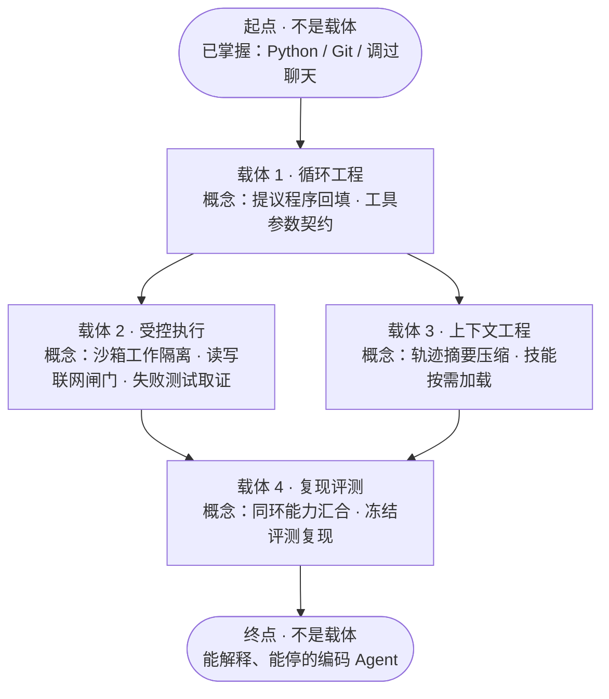

# 问山产品页全文替换方案

主线从「文档助手」换成「能修真实仓库问题的编码 Agent」。画布上的文章、作者、链接都可以按演示编写。

这一版把两条理念写进演示，不再只改例子：

1. **访谈用满 4 题。** 合同仍是 2–4 题、每题三个建议加自定义。四题只做两件事：收清已经理解什么、能熟练做什么；收清真正想做成什么，从而决定学什么、不学什么。
2. **进一步请教只处理 AI 给不了的判断。** 三类是评估、审美、亲历。模型可以写出架构和实现方案；真实试用、上线、交付前，仍要人来评估成不成立、有没有隐患、值不值得交出去。高审美的人看设计与呈现；有亲历的人讲真实经历。问 AI、问博主仍处理机制和公开写法，不把「模型答不上」当成请教的理由。

实现时：路线画的是载体层。起点只记录已掌握内容，不是载体；起点的下一座圆台才是第一个载体。四个载体各自包含多个概念：循环与契约；沙箱、闸门与检索；压缩与 Skills；汇合与评测。取证载体与窗口载体可以并列，检索排在取证载体内部最后，不能先于沙箱。学习演示仍落在第一层第一个概念。访谈从 3 拍加到 4 拍。

---

## 0. 一句话与不变量

产品页要让陌生人读懂的一句话：

> 大模型学习方向互相打架，是因为人们想做成的东西本来就不一样。问山先问清你已经会什么、真正要什么，再只生成通往这个成果的路线；机制问题问 AI 或对照公开文章，做成之后，把上线前评估、审美判断和亲历经验交给对应的人。

贯穿全页的作品：

> 做一个能在沙箱里修真实仓库问题的编码 Agent。模型提议工具，程序校验并执行；能停、能查、能复现评测。

故意不学、也不画进主线：从头训练、集群部署、完整数学课、多 Agent、A2A、先选框架再找目标、把仓库全文塞进窗口。这些不是开场口号，而是第 4 问收下来的非目标。

不要做的事：

- 把三条终点焊成一条课表
- 把框架名、协议名写成必学目录
- 用「AI 答不上来」引出问博主或请教
- 把请教写成继续问压缩、协议或实现细节
- 把公开文章写成对方已经回复或接单
- 为了画分支而重复同一内容
- 把 15 项前沿技术全部塞进一条路线

15 项前沿技术如何入戏：9 项走上这条求职路，其余只在开场争议或第 4 问的「不学」里出现。

| 技术 | 出现位置 | 对这个人的作用 |
| --- | --- | --- |
| Agent harness / 单循环 | 开场争议、阶段 1、学习演示 | 作品的骨架；第 3 问证明他还不会 |
| 结构化 / 程序化工具调用 | 概念 2 | 参数必须可校验 |
| 沙箱 | 载体 2「受控执行」第 1 个概念 | 能改仓库，不能改主机；与闸门、检索同属受控执行 |
| 权限闸门 / HITL | 载体 2 第 2 个概念、请教·评估 | 读、写、联网分开批准；排在沙箱之后、检索之前 |
| 确定性代码检索 | 载体 2 最后一个概念 | 同一载体里沙箱和闸门都齐了，才能在副本里 grep |
| 上下文工程 / 压缩 | 载体 3「上下文工程」、问 AI | 只依赖循环工程轨迹；与技能按需加载同属该载体 |
| Agent Skills / 渐进披露 | 载体 3 | 按需加载说明；与压缩同属窗口载体，交付时再汇合 |
| 可复现评测 | 阶段 4 | 用固定 issue 讲清成败 |
| 上线前评估 | 请教·评估 | 模型能写方案，不能替人判断这次交不交得出去 |
| 界面与作品呈现 | 请教·审美 | 模型不能替人看设计是否成立 |
| 亲历试用 / 面试 | 请教·真实经历 | 模型没有那次现场 |
| MCP / 生成-校验 | 开场争议旁证 | 不是完成条件 |
| 多 Agent / A2A / 预训练 | 第 4 问明确不学 | 超出每周六小时 |

---

## 1. 页头、导航、章节

产品动作句子大多保留。改与旧例子或旧访谈绑定的那几句：

| 位置 | 现文 | 替换 |
| --- | --- | --- |
| `index.html` title | 想做什么，就学什么 · 问山 ThreadPeak | 保留 |
| 滚轮提示、章节跳转 | 现有八个跳转 | 保留 |
| 研究 / 学习 chrome | 刘看山陪你学、问 AI、问博主、快速回答 | 保留 |
| 访谈计数 | `01 / 03` | `01 / 04` |
| 访谈页脚 | 访谈片段 · 确认目标、基础、时间与限制 | 访谈片段 · 先问清你会什么、想做成什么，再决定学什么 |
| 访谈 aria | 通过访谈明确目标，再规划学习路线 | 通过访谈收清已有能力和真正目标，再决定学什么、不学什么 |
| 知识脉络默认根卡 | 接通第一次模型对话 | 先跑通同一个 Agent 循环 |
| 默认笔记卡 | 把这一步的选择和预算记在自己的卡片里… | 把这一步留下什么、丢掉什么记在自己的卡片里，方便对照后续压缩。 |
| 请教副文 | 见第 10 节 | 必须改 |

检索等待条仍可写「搜索知乎」。

---

## 2. 开场：一个问题，不止一种答案

文件：`CenterDialogue.tsx`、`OrbitScene.tsx`、`characters.ts`

| 字段 | 替换 |
| --- | --- |
| 中央问题 | 如何系统学习大模型？（保留） |
| 目标模式 | 我想用它做成什么？（保留） |
| 主标题 | 一个问题，不止一种答案。（保留） |
| 副文 | 建议各有适用条件，从自己的目标与基础出发。（保留） |

六人对白：

| 角色 | 新对白 |
| --- | --- |
| 工程师 | 先做 harness\n别先训模型 |
| 软件工程师 | 先手写循环\n别先选框架 |
| 大学生 | 上下文和权限\n不能跳 |
| 设计学生 | 只做能修 issue\n何必补数学 |
| 老师 | 先懂工具调用\n再堆协议 |
| 研究员 | 先复现评测集\n别只追框架 |

十张滚动卡（`article-cards.json`，列分配不变）仍用五组相反意见：

| id | 标题 | 对立面 |
| --- | --- | --- |
| harness-first | 先做能修 issue 的 harness | theory-first：先补齐注意力，再碰工具 |
| loop-from-scratch | 先手写循环，别先选框架 | framework-first：先跟官方 SDK 跑通 |
| grep-first | 仓库检索先用 ripgrep | rag-first：仓库也要先做向量库 |
| eval-first | 没有固定 issue 集，就还没做成 | demo-first：先让人看见一次成功修复 |
| skills-progressive | Skills 按需加载，不要一次塞完 | dump-context：窗口够大，就把仓库塞进去 |

作者用演示名：林启衡、苏晚青、韩牧之、乔北辰、沈知夏、裴临川。链接写成 `https://www.zhihu.com/demo/<id>`。正文仍按上一版各卡的前言/正文写，证明「同一领域可以给出相反建议」，不要写成标准课表。

开场只负责把争议摊开。收成一条路的工作交给后面四问，不在开场替观众做选择。

---

## 3. 三种目标

文件：`scroll-transition.ts` 的 `goals`

标题仍是「不同的答案，各有目的地。」边注仍是「先确定目标，再选择建议。」

| id | tag | title | subtitle | steps |
| --- | --- | --- | --- | --- |
| application | 把它用起来 | 做成一个应用 | 让编码 Agent 能修真实仓库里的问题。 | 循环 → 沙箱与闸门 → 取证交付 |
| principles | 弄懂为什么 | 真正理解原理 | 讲清注意力、采样和工具调用为什么会错。 | 必要基础 → 核心机制 → 自己讲清 |
| research | 亲手验证它 | 复现一篇论文 | 读懂方法，在固定评测集上对照结果。 | 读懂方法 → 运行基线 → 对比实验 |

产品页主线只展开第一条。第 1 问会从三条里收成「求职作品」，另外两条继续证明终点可以不同。

---

## 4. 访谈：四问，两个目的

文件：`interview.ts`、`InterviewScene.tsx`、`route-choreography.ts`、`story-steps.ts`

标题仍是「把目标聊清楚，走自己的路。」

四问按两个目的成对出现，不要写成「目标 / 基础 / 时间」三件杂事。

| 目的 | 题 | 这一问要收清的未知 | 答完之后路线能做什么 |
| --- | --- | --- | --- |
| 真正想要什么 | 1 想做成什么 | 可观察的成果是什么 | 只为这一个成果选内容，不把另外两条终点焊进来 |
| 已经掌握什么 | 2 能独立做成哪步 | 哪些动作现在就能自己做 | 已会的不重教 |
| 理解到哪里 | 3 哪些能讲清 | 完整理解、听说过、完全没接触，要分开 | 从真正的缺口开始，不把「看过文章」当成会用 |
| 真正想要什么 | 4 这次不学什么 | 期限、非目标、明确砍掉的方向 | 训练、多 Agent、集群不进主线；时间只压节奏 |

每题界面仍是三个建议 + 独立自定义。演示里学习者选中的那一句，用作中央对白。

### 第 1 问 · 想做成什么

- id：`outcome`
- label：想做成什么
- 目的：真正想要什么
- question：学完以后，你想自己\n做成什么？
- reason：成果不同，必要内容就不同。先收成可观察的一件事。
- 三个建议：
  - 做一个能给别人试用的求职作品 → 路线只保留做出并讲清这个作品所需的部分
  - 先把生成和工具调用的原理讲清楚 → 走向理解，不把求职交付当作完成条件
  - 复现一篇方法，对照公开结果 → 走向验证，不把应用骨架当成主线
- 演示回答：`['做求职作品：', '能修仓库问题的', '编码 Agent。']`
- record：做出能修真实 issue 的编码 Agent
- effect：只为这一个作品建立循环、检索与评测，不把原理课或论文复现焊进来。
- 右侧意图卡：为求职，做一个 / *能修仓库问题的 Agent。* / 让想法，落到一件具体的作品。

### 第 2 问 · 能独立做成哪步

- id：`mastery`
- label：已经能做
- 目的：基础与掌握
- question：最近写代码时，\n哪些事你能自己做完？
- reason：已经能独立完成的动作不必重学。会写脚本和会讲概念不是同一件事。
- 三个建议：
  - 能自己写脚本，也能用 Git 看差异、提交 → 语言和 Git 不进主线
  - 写过业务代码，但还很少自己查差异、改测试 → 保留极短的仓库操作，不从语法开始
  - 主要在课上跟着做，还很少独立写完一个小工具 → 先补到能独立改仓库，再进循环
- 演示回答：`['会 Python，', '也会用 Git', '看差异。']`
- record：已能独立写 Python 脚本，并用 Git 查看差异
- effect：不重教语言和 Git；从第一次 Agent 循环开始。
- 右侧意图卡：这些已经能自己做完， / *不必再学一遍。* / Python · Git · 不占主线

### 第 3 问 · 哪些能讲清

- id：`understanding`
- label：理解到哪
- 目的：基础与掌握
- question：这些说法里，\n哪些你已经能自己讲清？
- reason：听说过、看过教程、能自己讲清并做出来，要分开。不能把「知道这个词」当成已经掌握。
- 三个建议：
  - 调用过聊天接口；工具循环、沙箱、权限都还不能自己做 → 从第一次循环教起，沙箱与权限是必学
  - 循环和工具都写过，卡在权限划分和评测 → 缩短循环，把课时留给闸门和评测
  - 这些词都只在文章里见过 → 先用可观察的小循环建立直觉，再引入权限
- 演示回答：`['调过聊天接口，', '循环和沙箱', '都还不会。']`
- record：调用过聊天接口；尚未独立写过工具循环，也不能讲清沙箱与权限
- effect：从第一次循环开始；沙箱和权限不是选修。不把「用过 ChatGPT」当成会做 Agent。
- 右侧意图卡：用过聊天，还不等于 / *会写循环。* / 从真正的缺口开始

### 第 4 问 · 这次不学什么

- id：`nongoal`
- label：先不学什么
- 目的：真正想要什么
- question：这次有哪些事，\n你明确先不做？
- reason：非目标和期限决定哪些热点不进主线。时间只压缩节奏，不加课。
- 三个建议：
  - 每周只有六小时，先做完应用；不训练，不上多 Agent → 训练、多 Agent、集群不进主线
  - 时间和算力都够，训练也可以走一截 → 才允许出现训练相关阶段，演示不走这条
  - 想先铺完整知识面，不急着交作品 → 走向系统学习，演示不走这条
- 演示回答：`['每周六小时，', '先做好应用，', '不训练、不多 Agent。']`
- record：每周六小时；先完成应用作品；不训练底层模型，不上多 Agent
- effect：按可投入时间拆小步骤；训练、多 Agent、集群不出现在主线。
- 右侧意图卡：时间有限，先砍掉 / *不是这个作品的部分。* / 不训练 · 不多 Agent

### 四问收成的条件（给路线用）

写进路线起点卡，不要再散落成口号：

```
已能独立写 Python、用 Git 看差异。
调用过聊天接口，但还不能自己写工具循环，也不能讲清沙箱和权限。
要做成能修真实 issue 的编码 Agent。
每周六小时；不训练模型，不上多 Agent。
```

### 实现时必须加一拍

现网是 3 拍：`interviewBeats = [1.74, 2.10, 2.46]`，路线平台约 `2.52` 出场。第 4 问若仍挤在 `2.46` 之后，会和第 3 问或路线重叠。

建议：

```
interviewBeats = [1.74, 2.08, 2.42, 2.76]
STORY_STEPS 增加 interview-understanding、interview-nongoal
章节「跳到学习路线」的 raw 随路线平台后移
routeTimes.platforms 起点约 2.88，后续 guide / expand 整体平移，保持现有相对间距
```

计数改为 `01 / 04`。`storyAt().beat` 按四个阈值取值 `0..3`。中央对白继续读 `interviewTurns[beat].answer`。

---

## 5. 3D 路线：载体层，概念挂在载体上

文件：`interview-route.json`

路线画的是载体，不是把每个概念立成一座圆台。起点和终点都是主体，不是载体。3D 上第一座圆台是起点；**下一座圆台**才是第一个载体，概念从那里开始落下。

现有 9 个概念 ID 不变，仍挂在 4 个载体上。每个载体必须写清它包含哪些概念。取证与窗口可以并列；检索是取证载体里的第三个概念，不能和沙箱分成两个同级载体，更不能和沙箱并列。

并行只用于「一条支路的最小练习不需要另一条的知识或产物」。共同整合放在汇合载体。不为好看把可选方案画成并列，也不把必须一起具备的条件画成二选一。



### 5.1 从目标反推

成果目标：在仓库副本里修真实失败测试，能停、能复现。  
学习目标：自己能讲清循环、权限和评测，能改约定范围内的失败，不要求会训练模型。  
允许的帮助：现成模型接口、现成测试、文档。  
明确不学：预训练、多 Agent、集群、完整数学、先选框架。

靠近终点必须能做的事：定位失败测试 → 在沙箱里读代码 → 申请写入 → 跑测试 → 用轨迹说明成败。  
四问已经收齐的起点不再建节点。再往下只补缺口。

### 5.2 谁和谁可以并列，谁必须先齐

| 关系 | 节点 | 判定 |
| --- | --- | --- |
| 组成 | 取证载体含沙箱、闸门、检索 | 同一载体内部按顺序学；检索排最后 |
| 组成 | 窗口载体含压缩、Skills | 同一载体的两个概念，最小练习互不依赖 |
| 必要前置 | 检索需要沙箱 **且** 闸门 | 缺隔离，grep 落在主机；缺分类，写入看起来像自动发生 |
| 必要前置 | 压缩、Skills 需要第一层循环 | 没有可观察轨迹，压缩没有对象；Skills 无处按需注入 |
| 辅助 | MCP、生成-校验 | 达标不必要，不进主线 |
| 可并行 | 取证载体 ∥ 窗口载体 | 窗口的最小练习不需要检索产物；取证的最小练习不需要压缩 |
| 必须汇合 | 两路齐了才进交付载体 | 3D 两路接到同一节点；也是能力上的「同时具备」 |
| 不可并行 | 检索 与 沙箱、闸门 | 检索不能单独立成载体，更不能和沙箱并列 |

进入下一载体前，它写出的全部必要前置都要齐。可以多等，不能少。压缩只强依赖循环轨迹，所以可以和取证并列；检索必须留在取证载体内部。

### 5.3 每条边缺了会在哪断

| 从 | 到 | 后续哪一步用它 | 缺了会怎样 |
| --- | --- | --- | --- |
| 起点 | 载体 1 | 写出第一轮可观察调用 | 把语言课塞进循环，或把起点当成第一个载体 |
| 循环 | 契约 | 拿一次真实调用做校验 | 后面分不清「调用不合法」和「沙箱拒绝」 |
| 载体 1 | 载体 2、载体 3 | 两路同时从这里分出 | 把检索单独拉出去和沙箱并列 |
| 沙箱 | 闸门 | 同一载体里的下一概念 | 批准看起来像自动发生 |
| 闸门 | 检索 | 同一载体里的最后一个概念 | grep 落在主机 |
| 循环轨迹 | 压缩、Skills | 窗口载体的两个概念 | 压缩没有对象；Skills 不知道何时注入 |
| 载体 2 + 载体 3 | 汇合 | 两路齐了才进交付载体 | 零件分别会了，还不能修一个 issue |
| 汇合 | 评测 | 同一循环上的完整轨迹 | 评测只剩一次幸运修复 |
| 评测 | 终点 | 一成一败落在哪一层 | 只有零件，没有作品 |

观察回填必须写在循环里，不拖到压缩。否则沙箱、闸门、检索都会临补「历史怎么接」。

### 5.4 阶段编排（R4 形状）

`false → true → false`。示例展示这种字段形状，不要求每条用户路线都抄这个阶段数。3D 仍是起点 + 四个载体圆台 + 终点；不要把起点画成第五个载体。

| 阶段 | parallel | 载体 | 本载体包含的概念 | 前置必须齐什么 |
| --- | --- | --- | --- | --- |
| 1 | false | `carrier-job-contract` | 循环、契约 | 起点（已掌握，不是载体） |
| 2 | true | `carrier-job-tools` ∥ `carrier-job-evidence` | 沙箱、闸门、检索 ∥ 压缩、Skills | 阶段 1 整层 |
| 3 | false | `carrier-job-deliver` | 汇合、评测 | 阶段 2 两路 |

### metadata

```
title: 编码 Agent 求职路线
description: 已能独立写 Python 并用 Git 看差异，调用过聊天接口，但还不会工具循环、沙箱和权限。每周六小时，做成能修真实 issue 的编码 Agent；不训练，不上多 Agent。起点只记录已掌握内容，不是载体；下一座圆台才开始收概念。四个载体分别含：循环与契约；沙箱、闸门与检索；压缩与 Skills；汇合与评测。时间只安排节奏，不承诺固定周期完成。
```

### 起点与终点

**card-start**

- eyebrow：路线起点 · 不是载体
- title：从这里出发
- summary：已能独立写 Python 脚本，并用 Git 查看差异；调用过聊天接口。还不能自己写工具循环，也不能讲清沙箱与权限。下一座圆台才是第一个载体。目标是求职用的编码 Agent。每周六小时；不训练底层模型，不上多 Agent。

**card-goal**

- eyebrow：学习目标 · 不是载体
- title：能解释、能停下来的编码 Agent
- summary：在沙箱里检索代码、受控写入并修真实 issue；自己能解释循环、权限和一次失败定位在哪一层。允许使用现成模型和现成测试，不要求实现模型内部。

### 阶段 1 · 循环工程 · `carrier-job-contract`

本载体含：循环、契约。  
用一个只读工具，走完提议 → 校验 → 执行 → 回填观察 → 停止。本层收齐之后，才分出取证载体和窗口载体。

**概念 1 · 提议程序回填：模型提议，程序执行**

- 学什么：一轮可观察的循环；含回填与停止，不只是发出第一句聊天。
- 边界：第一次只给只读工具；不在本节点写文件、不讲沙箱实现。
- 为什么：没有循环，沙箱、闸门、检索都没有可接的执行位置。
- 必要前置：起点里的 Python、Git、聊天请求。
- 允许的外部：现成模型接口。密钥从环境读。
- 完成检验：指出哪一步由模型提出、哪一步由程序执行、观察从哪回填、超过 8 轮如何停。

**概念 2 · 工具契约：参数必须可校验**

- 学什么：工具名和参数是程序契约；缺字段、越界路径必须失败。
- 边界：结构合法不等于操作该发生；读/写/联网留给闸门。
- 为什么：缺了它，检索无法区分「调用不合法」和「沙箱拒绝」。
- 必要前置：概念 1（有一次真实工具调用来校验）。
- 完成检验：合法调用执行；缺字段与指向工作区外的路径明确失败，不补默认值。

### 阶段 2 · 分叉：取证载体 ∥ 窗口载体

两路都必学。取证载体内部按沙箱 → 闸门 → 检索学；窗口载体含压缩与 Skills。汇合点是交付载体，不是彼此。

#### `carrier-job-tools` · 受控执行

本载体含：沙箱、闸门、检索。

**概念 3 · 沙箱：改仓库，但不能改主机**

- 学什么：工作目录限制在副本；逃出工作区的路径拒绝。
- 边界：不讲容器内核；不在本节点做检索策略，也不教批准分类。
- 必要前置：阶段 1 整层。
- 完成检验：工作区内读取放行，`../` 与工作区外路径拒绝。

**概念 4 · 权限闸门：读、写、联网分开批准**

- 学什么：只读可自动；写入和联网必须申请；拒绝要回填。
- 边界：不在本节点设计整页 UI。
- 必要前置：本载体的沙箱概念。
- 完成检验：只读自动、写入需申请、联网需申请各举一例。

**概念 5 · 确定性检索：先用程序找代码**

- 学什么：用失败测试名、报错和符号做精确匹配；命中不是依据。
- 边界：不做向量库；不把整仓塞进窗口。
- 必要前置：同一载体里的沙箱与闸门。
- 完成检验：两个能定位的问题和一个名称对不上的问题，说明命中是否含该看的代码。

#### `carrier-job-evidence` · 上下文工程

本载体含：压缩、Skills。最小练习只需要第一层循环轨迹。

**概念 6 · 上下文工程：压缩轨迹，不堆全文**

- 学什么：保留目标、已改文件、失败测试和最近工具结果；重复探索做成摘要。
- 必要前置：阶段 1。不需要检索产物。
- 完成检验：12 步压完仍能复述改了什么、为何失败。

**概念 7 · Skills 渐进披露：需要时才加载说明**

- 学什么：跑测试、提交前检查各一份短说明；用到再注入，用完移出。
- 必要前置：阶段 1。不需要压缩产物。
- 完成检验：定位到测试后只出现测试说明，准备提交时才出现检查说明。

### 阶段 3 · 汇合 · 复现评测 · `carrier-job-deliver`

本载体含：汇合、评测。  
同一循环完成定位、申请写入、跑测试；用固定 issue 留下一成一败。前面的零件分别会了，不等于已经能修一个 issue。

**概念 8 · 汇合：接到同一个循环里**

- 学什么：检索、权限、压缩和 Skills 为同一个失败测试服务；不另起项目，不引入第二个 Agent。
- 边界：不在本节点发明新工具协议。
- 为什么：缺了它，前面只是零件。
- 必要前置：取证载体与窗口载体两路都齐。
- 完成检验：覆盖只读定位、申请写入、工具失败；每种情况都能解释为何使用或不使用某类工具。

**概念 9 · 可复现评测：用固定 issue 讲清成败**

- 学什么：冻结 8–12 个 issue，记录轨迹、补丁和测试；区分检索失败、错误编辑和测试不稳。
- 边界：不要求提交公开榜；评测证明能重复自己，不代替请人做上线前评估。
- 为什么：缺了它，作品只是一次演示运气。
- 必要前置：概念 8（先有同一循环上的完整轨迹）。
- 完成检验：同一组 issue 重现一成一败，能指出失败落在循环、隔离、批准、检索还是窗口。

### 5.5 不画进路上的东西

| 内容 | 处理 |
| --- | --- |
| Python、Git、聊天请求 | 起点，不是载体，不建概念 |
| 预训练、多 Agent、集群、完整数学 | 第 4 问非目标 |
| MCP、生成-校验 | 辅助，达标不必要 |
| 向量库、整仓塞窗口 | 争议里出现，本路线不收 |
| 上线前评估、审美、亲历 | 做成之后的请教，不是又一个载体 |

### 5.6 实现时的边

```
route-start → carrier-job-contract
carrier-job-contract → carrier-job-tools      split-carrier-job-contract
carrier-job-contract → carrier-job-evidence   split-carrier-job-contract
carrier-job-tools → carrier-job-deliver       join-carrier-job-deliver
carrier-job-evidence → carrier-job-deliver    join-carrier-job-deliver
carrier-job-deliver → goal-understanding
```

同一分叉的两路之间不写直边。不能一路跳到终点。  
3D 标签只写四个载体，不给起点或终点写载体字。每张载体卡和每张概念卡都写清「这个概念属于哪个载体」。边只推荐顺序，不锁节点。

---

## 6. 学习开始卡

```
顶栏：我的目标 · 做出编码 Agent
标题 alt：提议程序回填：模型提议，程序执行
正文：
  脚本和 Git 已经能自己做，就从还不会的循环开始。
  只补当前步骤缺的知识，边做边验证；
  把理解和追问，接着留在知识脉络里。
底栏：按目标学 · 在项目里试 · 沿卡点问
```

---

## 7. 研究页与讲解

| 字段 | 替换 |
| --- | --- |
| title | 提议程序回填：模型提议，程序执行 |
| goal | 我的目标 · 做出编码 Agent |
| goalNote | 让第一次循环，落在自己的仓库副本里。 |

四张演示资料：

1. 先写一个能停下来的循环 · 林启衡  
2. 工具调用是程序契约，不是对话技巧 · 苏晚青  
3. 失败轨迹比成功回复更值得留下来 · 韩牧之  
4. 第一次循环只用只读工具 · 乔北辰  

四段讲解：

1. 先跑通同一个 Agent 循环  
2. 用一次小检查，确认循环真的接通  
3. 工具调用必须先被程序看懂  
4. 下一轮要带上需要的观察  

讲解正文仍针对「他还不会循环」：复用 Python / Git，不重教；成功只证明循环接通。具体段落见实现稿上一版第 7 节，不必改技术内容。

---

## 8. 问 AI 与问博主：模型还处理得了的问题

这两步仍在学习中，处理机制选择和公开写法。它们不是请教的预告片。

```ts
export const projectScenario = {
  goal: '做一个能修真实仓库问题的编码 Agent',
  question: '原型已经能在沙箱里定位失败测试并申请写入。有些判断我没法交给模型：上线或试用前值不值得交出去、有没有隐患，批准写入的界面别人能不能一眼看懂风险，以及真正拿这种作品去试用的人当时卡在哪。',
  context: '作品已经能跑。机制问题已经在学习和公开文章里核对过；现在要找的是模型给不了的判断。',
  footprintQuestion: '循环超过八步之后，失败的工具结果该原文回填，还是先压成摘要？',
  note: `### 把循环接进作品

**目标**：做能修真实 issue 的求职 Agent。

**已经会**：Python 脚本，Git 看差异。

**这次不学**：训练模型，多 Agent。

**选择**：失败的工具结果原文回填，重复探索做成摘要。

$$
T_{\\mathrm{in}} + T_{\\mathrm{out}} \\leq W
$$

**已验证**：只读循环两轮，核对提议、执行与停止。

**下一步**：沙箱权限、检索与评测。做成之后，再请人做上线前评估、看呈现、听亲历经验。`,
};
```

问 AI（机制，模型可以帮选）：

```
question: 循环变长以后，失败的工具结果该原文回填，还是先压成摘要？

1. 先分清「丢掉重复」和「丢掉原因」
   目录列表可以摘要。未经处理的失败原因应尽量原文回填。

2. 把选择理由留在自己的卡片里
   当前选择：失败原文回填，重复探索做成摘要。
   继续查证：看看公开文章里别人怎么写，不把这当成请人评审。
```

问博主（公开写法，仍不是咨询）：

```
问题：循环超过八步之后，失败的工具结果该原文回填，还是先压成摘要？

1. 观点一：核对失败有没有被真正送入
2. 观点二：压缩要按任务阶段切换
3. 观点三：给别人看时，失败案例更有用
每张卡都写适用边界：这是公开写法，不是对这个仓库的评审，也不是已经答应咨询。
```

足迹项目句：`编码 Agent：超过八步后如何压缩`

---

## 9. 博主网络与足迹

眉题、主标题、注脚保留。

这一段证明的是：问题连到公开经验。请教还没有开始。画面上不要出现「AI 失败，所以找人」。

---

## 10. 进一步请教：只找 AI 给不了的判断

文件：`consultation-content.ts`、`consultation-extra-authors.json`、`ConsultationStoryScene.tsx`

| 字段 | 替换 |
| --- | --- |
| 眉题 | 进一步请教 · 可选（保留） |
| 主标题 | 带着问题，寻找合适的人。（保留） |
| 副文 | 有些判断模型给不了。方案写得出来，还要人评估这次交不交得出去；界面够不够让人看懂风险，要找高审美的人；亲历者当时踩过什么坑，要找过来人。 |
| 输入占位 | 你具体卡在哪里，想获得什么帮助？（保留） |
| 演示注 | 公开内容帮助匹配 · 咨询经验、意愿与费用需另行确认（保留） |
| 足迹第二句 | 从跑通循环，到请人做上线前评估、看呈现、听亲历经验 |
| 请教问题 | `projectScenario.question` |

六张卡必须能被观众分成三类：评估、审美、亲历。不要写成请人「写架构」——模型也能写方案；请的是真实试用或上线前，有没有人愿意为这次交付做评估。

| 人 | 类型 | topic | 请他判断的事 | 来源 |
| --- | --- | --- | --- | --- |
| 林启衡 | 评估 | 上线前评估，交不交得出去 | 单循环 + 沙箱 + 权限，进入真实试用有没有逃逸或过度授权 | 学习足迹 |
| 苏晚青 | 审美 | 呈现设计，看懂风险 | 批准写入的界面和轨迹展示，别人能不能一眼看出风险 | 学习足迹 |
| 韩牧之 | 亲历 | 试用现场，真实卡点 | 拿类似作品去试用或面试时，评委实际卡在哪 | 学习足迹 |
| 乔北辰 | 评估 | 作品边界，这次够不够 | 用 8–12 个冻结 issue 当实习作品，上线或试用前还漏了哪类隐患 | 补充检索 |
| 沈知夏 | 审美 | 作品叙事，像作品还是日志 | 演示录屏和说明页的层次，看起来像作品还是一堆日志 | 补充检索 |
| 裴临川 | 亲历 | 第一次交出去 | 第一次把沙箱 Agent 交给别人试用时出过什么事 | 补充检索 |

### 前三位（有学习足迹）

**林启衡 · 评估**

- title：沙箱循环能停，还不等于可以给人试用
- lead：从上线前评估，看它这次交不交得出去。
- summary：学习时读过他写循环和沙箱的文章。现在要请的不是再写一版架构，而是评估：当前权限表和逃逸路径在真实试用里有没有隐患，这个原型值不值得交出去。
- quote：能停下来只说明循环被你看住了。能不能给人试用，要看它越权时谁先停。
- limitation：公开文章谈的是机制；是否愿意做上线前评估、收费和范围都需另行确认。
- ask：希望你评估这份权限表和脱敏轨迹：在真实试用里有没有逃逸、过度授权或不可观察的失败，以及它现在值不值得交出去。
- badge：演示作者 · 评估

**苏晚青 · 高审美**

- title：批准写入的那一屏，决定别人信不信你
- lead：从呈现上，看别人能不能读懂风险。
- summary：学习时对照过她谈轨迹怎么给人看的文章。现在要请的不是压缩策略，而是审美判断：批准写入、拒绝联网、失败红字这些状态，在界面上是否分得清，会不会看起来像安全的自动执行。
- quote：风险如果要靠一段说明才能看懂，界面就已经在替模型说话。
- limitation：文章给的是呈现原则，不是对这个界面的设计评审，也不代表已接视觉咨询。
- ask：希望你从设计判断出发，看批准写入和轨迹展示的演示：别人是否能在三秒内看出「读是自动的，写必须经过我」。
- badge：演示作者 · 设计判断

**韩牧之 · 亲历经验**

- title：我把类似作品带进试用，评委先问了什么
- lead：从现场，听一次真实被问倒的经历。
- summary：学习时读过他写失败案例为什么值得留。现在要请的是亲历：他带着可复现 issue 和轨迹去试用或面试时，对方先攻击哪一层，自己当时怎么接。
- quote：他们几乎不问模型叫什么。他们问：如果它改错了生产配置，谁能停住。
- limitation：这是一次个人经历，不能当成你的评委清单，也不等于他已答应复盘咨询。
- ask：希望你讲当时的现场：评委先问什么、你的轨迹哪一段帮上了忙、哪一段反而让人更不放心。
- badge：演示作者 · 亲历者

### 后三位（补充检索，无足迹）

**乔北辰 · 评估**

- title：固定 issue 集证明什么，证明不了什么
- topic：作品边界，技术是否站得住
- lead：从可行性上，看这组证据够不够。
- summary：文章区分「能复现」和「能进入别人的仓库」。可据此请人评估：8–12 个自选 issue 作为实习作品，真实试用前还漏了哪类隐患。模型可以列出评测项，不能替人判断这次交不交得出去。
- quote：评测集说明你能重复自己。试用关心的是，换一个仓库时你还能不能停住它。
- limitation：作者讨论的是评审口径，不是对你这组 issue 的结论，也不代表已接单。
- ask：希望你评估这组冻结 issue 和权限设计：作为求职作品，正式试用或上线前还缺哪类风险证据，现在交不交得出去。
- 正文摘录：

```
冻结一组 issue，能证明循环、检索和权限在你熟悉的仓库里能闭环。它证明不了：换一套目录结构、换一种发布脚本、或者出现你没写进工具白名单的操作时，系统还会不会守住边界。

上线前评估通常先问三件事。谁能改文件？谁能联网？失败时记录能不能让第三人定位。答不上来，分数再高也只是演示。

评测集说明你能重复自己。试用关心的是，换一个仓库时你还能不能停住它。
```

**沈知夏 · 高审美**

- title：演示录屏最怕看起来像一段日志
- topic：作品叙事，像作品还是日志
- lead：从观感上，看它像不像一件作品。
- summary：作者谈如何把工具轨迹编成别人愿意看完的演示。可请她看录屏和说明页的层次，判断哪里像作品、哪里像调试输出。
- quote：观众先看见秩序，才会相信你控制得住风险。
- limitation：审美判断因人而异；文章不是对你录屏的最终设计，也不代表已接受委托。
- ask：希望你看两分钟演示和一页说明：信息层次、停顿和强调是否让人先看见「它被管住了」，而不是先看见一堆命令。

**裴临川 · 亲历经验**

- title：第一次把沙箱 Agent 交给同事以后
- topic：第一次交出去
- lead：从一次真实交付，听交接时掉了什么。
- summary：作者写过把内部编码 Agent 交给另一组试用的经过。可请他讲：对方最先误解了哪项权限，自己后来补了什么约束。
- quote：对方把「可以申请写入」听成了「它会自己改完」。这不是提示词问题，是交接问题。
- limitation：这是特定团队的一次交接，不能直接当成你的上线清单。
- ask：希望你讲第一次交出去时实际发生的事：对方误解了什么、你后来改了哪条权限或哪块说明、哪些是事后才知道的隐患。

### 草稿模板

按类型换请求，不要六封信都像在问实现细节。

```ts
export function consultationDraftFor(index: number, purpose = 'consult') {
  const a = consultationAuthors[index];
  return `${a.name}，你好！

我在做一个能修真实仓库问题的编码 Agent。原型已能在沙箱里定位失败测试并申请写入。循环、压缩这些机制，我已经在学习和公开文章里核对过。

现在想请你看的是模型给不了的部分。看到你的《${a.title}》。${a.ask}

我可以先整理演示录屏、脱敏轨迹、权限表，以及已通过和待验证的 issue。

${purpose === 'invite'
  ? '如果你愿意分享当时的处理过程，想邀请你讲清现场、判断和后来补上的约束。谢谢！'
  : '请问你是否愿意就这一项判断提供付费评审或交流？希望先确认范围、所需材料和费用，再约时间。谢谢！'}`;
}
```

作者详情「知乎 · 公开文章」可保留为容器文案。后三张卡继续走「还没有学习足迹」。

请教页不要出现的句子：

- AI 没能回答，所以来找你
- 请再讲一遍如何压缩 / 如何接 MCP
- 请帮我写一版架构（模型也能写；请的是评估这次交不交得出去）
- 你已经回复过我 / 你已经接单

---

## 11. 结尾

品牌句「想做什么，就学什么。」整段保留。

| 岛 | 新字 |
| --- | --- |
| 论文 | 上传 PDF，结合目标拆解这篇方法里真正要用的部分。 |
| 收藏 | 结构保留；切回时写「回到 Agent 收藏」 |
| 路线聚焦 | 被收起的旁支：预训练、多 Agent、集群部署、完整数学课（对应第 4 问） |
| 纯目标 1 | 做一个能修仓库问题的编码 Agent → 循环 / 沙箱与闸门 / 交付验证 |
| 纯目标 2–3 | 旅行摄影、储蓄计划，保留 |

论文岛假页：

- 首页：Harness Engineering for Repository Repair
- 方法页：先冻结一组 issue，再比较有无沙箱权限时的失败分布。

---

## 12. 艺术字重绘清单

访谈标题「走自己的路。」不用重绘。路线 4 张载体字按学科统称：循环工程、受控执行、上下文工程、复现评测。9 张概念字竖排重绘：提议程序回填、工具参数契约、沙箱工作隔离、读写联网闸门、失败测试取证、轨迹摘要压缩、技能按需加载、同环能力汇合、冻结评测复现。网络四张主题字与四个载体名对齐。起点和终点不写载体字。

---

## 13. 文件对照

| 文件 | 改什么 |
| --- | --- |
| `interview.ts` | 四问全文、record、effect |
| `InterviewScene.tsx` | ` / 04`、四段意图卡、页脚、aria |
| `route-choreography.ts` | 四个 beat、路线平台后移 |
| `story-steps.ts` / `chapters.ts` | 增加两拍，路线章节 raw 随移 |
| `characters.ts` | 六人对白 |
| `article-cards.json` | 开场十张争议卡 |
| `scroll-transition.ts` | 三条目标 |
| `interview-route.json` | 4 载体各写所含概念；起点/终点标明不是载体；卡片按第 5 节重写 |
| `LearningStartCard.tsx` | 从「已会的」跨到「还不会的」 |
| `lesson-cards.ts` / `learning-content.json` | 研究资料与讲解 |
| `learning-story-content.ts` | 问 AI 仍是机制；请教问题改成三类判断 |
| `consultation-content.ts` | 六人按评估 / 审美 / 亲历重写 |
| `consultation-extra-authors.json` | 后三位 |
| `ConsultationStoryScene.tsx` | 副文 |
| `ConsultationAuthorDetails.tsx` | 足迹第二句 |
| 结尾三件 | 论文说明、旁支、纯目标示例 |
| `assets/lettering/route/**` | 4 张载体字 + 9 张概念字 |

问 AI / 问博主的交互 chrome 不改。请教六张卡的类型必须能被读出来。

---

## 14. 和首页示例的分工

产品页用编码 Agent 求职作品，把「四问收条件 → 只学缺口 → 做成后再请人看模型给不了的部分」演一遍。首页「系统学习大模型」可以继续走理解与验证。两套例子并存，证明同一领域会因目标不同走出不同路线。

---

## 15. 验收时逐页核对

1. 开场六句对白互相打架，没有提前替观众选路。
2. 访谈是 4 问，不是 3 问；第 2、3 问谈的是会做什么、能讲清什么；第 1、4 问谈的是要做成什么、明确不学什么。
3. 路线起点能读出四问原话，并且标明它不是载体；下一座圆台才是「循环工程」。
4. 四个载体都能读出各自包含的概念。取证与窗口并列；检索在取证载体内部、排在沙箱和闸门之后。没有 Python 课、训练课、多 Agent，也没有「先检索再补沙箱」。
5. 问 AI 处理压缩；问博主给公开写法；两者都不说「所以去咨询」。
6. 请教六人能分成评估、审美、亲历；评估卡请的是上线或试用前交不交得出去，不是请人写架构。没有人在请教环节继续讲如何调用 API。
7. 草稿请求的是判断、现场或设计，不是补课；不自动发送。
8. 结尾三条入口仍在；被收起的旁支能对上第 4 问。
