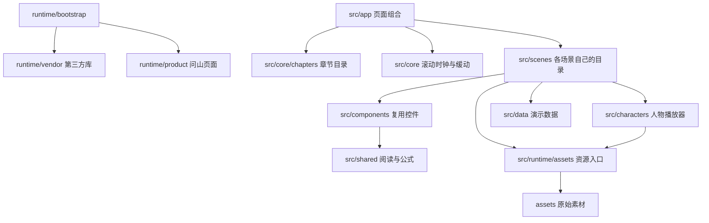

# 问山 · 独立产品页

双击 [index.html](index.html) 即可浏览，无需安装软件或启动项目。复制或分享时，请保留整个文件夹。

完整保留原产品页的滚动演示、人物动画、3D 路线、学习卡片、博主网络与结尾交互；移除了 GitHub、演示视频、登录和结尾登录跳转入口。页面使用静态演示数据，不连接账号或后端。主动点击文章的“阅读原文”时才会打开外部网站。

## 目录怎么读

| 目录或文件 | 用途 | 是否直接编辑 |
| --- | --- | --- |
| `index.html` | 打开页面的入口 | 由构建生成 |
| `src/app/` | 页面入口与章节组合 | 是 |
| `src/scenes/` | 开场、目标、访谈、路线、学习、博主网络、请教、结尾 | 是 |
| `src/core/` | 统一滚动进度、章节步骤和共享文字动画 | 是 |
| `src/characters/` | 人物配置、React 展示层和共享 Rive 渲染器 | 是 |
| `src/components/` | 导航、品牌插画、学习卡片与控件 | 是 |
| `src/runtime/` | 本地资源加载与启动适配 | 是 |
| `src/shared/` | 阅读/数学公式处理和展示数据类型 | 是 |
| `src/data/` | 章节示例、文章、作者和路线 JSON | 是 |
| `src/styles/` | 原始样式；局部样式也与组件放在一起 | 是 |
| `assets/images/` | 人物静态图、问山插画和博主头像 | 是 |
| `assets/lettering/` | 标题艺术字、路线标签等 SVG | 是 |
| `assets/fonts/` | 正文和数学公式字体 | 是 |
| `assets/rive/` | 七个独立人物动画 `.riv` | 是 |
| `assets/wasm/` | Rive 动画引擎 `.wasm` | 保留原始文件 |
| `assets/models/` | 刘看山行走和待机 `.glb` 模型 | 是 |
| `assets/offline/` | 双击运行需要的兼容资源包，只包含资源数据 | 自动生成 |
| `assets/manifest.json` | 资源路径、大小、校验值与兼容包对应关系 | 自动生成 |
| `runtime/vendor.js` | 编译后的 React、Three.js、Remotion、KaTeX | 自动生成 |
| `runtime/product.js` | 编译后的问山页面代码，不含第三方库和媒体 | 自动生成 |
| `runtime/bootstrap.js` | 按顺序加载资源、依赖库和页面代码 | 自动生成 |
| `styles/` | 编译后的布局样式与普通字体声明 | 自动生成 |
| `data/` | 编译后的演示数据，独立于业务代码 | 自动生成 |
| `vendor/rive/` | 原始 Rive JavaScript 运行库 | 保留原始文件 |
| `scripts/` | 构建、资源校验、本地预览 | 是 |
| `licenses/` | 开源库和字体的版权、许可证 | 随文件夹保留 |

学习卡片、博主网络和请教场景的博主头像放在 `assets/images/authors/`，按作者名保存，且只保留页面实际用到的照片。开场滚动卡片的头像和认证标在组件里绘制，不再另存图片文件。

## 模块边界



`App.tsx` 只组合章节。章节入口在 `src/core/chapters.ts`。共用缓动在 `src/core/motion.ts`，共用时间轴在 `src/core/timeline.ts`。场景不要互相引用；需要头像用 `components/learning/CardAvatar.tsx`。开场人物在 `scenes/orbit/OrbitScene.tsx`；六种人物共用 `characters/mount-character.js`。学习演示只引用 `GraphCard`、`NodeToolbar`、`NodeEditor` 等展示组件。源码不再依赖主项目的 `@threadpeak/*` 包。运行时资源文件名只使用 ASCII，便于拷贝到任意电脑后双击打开。

## 为什么还有 offline 目录

浏览器直接打开 `file://` 文件时，不允许像服务器页面一样通过 `fetch` 读取本地 WASM、Rive 和 GLB。为了同时满足“代码和资产分开”与“双击 index.html 可运行”，原始资源保持独立，构建时再生成单独的离线兼容包。

- 双击打开：启动代码读取 `assets/offline/`。其中只有经过编码的资产数据，不放页面业务逻辑。
- 通过 HTTP 打开：直接读取 `assets/images/`、`rive/`、`models/`、`fonts/` 等原始文件，不加载离线包。
- `runtime/vendor.js` 只放第三方库；`runtime/product.js` 只放问山页面模块。二者都不是手改源码。

两种入口使用同一套页面代码。修改原始素材后运行构建，兼容包会同步更新；本目录的 `verify` 脚本会逐文件比对它们的 SHA-256，阻止原始文件和离线副本不一致。

## 修改与构建

浏览成品不需要 Node.js。修改源码并重新构建时，需要 Node.js 24 或更新版本；在本文件夹内执行：

```sh
npm ci
npm run check
npm run build
npm --prefix . run verify
```

在本文件夹内运行 `npm --prefix . run preview` 可启动 HTTP 预览，默认地址为 `http://127.0.0.1:4388`。如端口已占用，可用 `PORT=14388 npm --prefix . run preview` 指定其他端口。该小项目有独立的依赖清单和锁文件，可移出原仓库后维护。

修改文案看 `src/data/` 和相应的 `src/scenes/`；修改章节节奏看 `src/core/story-steps.ts`；修改人物看 `src/characters/` 和 `assets/rive/`；替换图片或模型看 `assets/`。固定艺术字是 SVG，改文字时也要同步修改对应 SVG 和可访问文本。运行时只依赖本文件夹中的文件。

## 怎么改、怎么加

| 你想做的事 | 打开哪里 |
| --- | --- |
| 改某一段演示文案、作者、资料 | `src/data/` 里对应 JSON，然后看该场景的 `src/scenes/<场景>/` |
| 改滚动停顿和 59 步节奏 | `src/core/story-steps.ts` |
| 改章节跳转入口 | `src/core/chapters.ts`，再在 `src/app/App.tsx` 挂上场景 |
| 改共用动画曲线 | `src/core/motion.ts` |
| 改场景出现的时间范围 | `src/core/timeline.ts` |
| 加人、改口白 | `src/scenes/orbit/characters.ts`、`src/characters/`、`assets/rive/` |
| 加一张学习卡或一位博主 | `src/data/learning-content.json` 或 `author-network-content.json`，头像放到 `assets/images/authors/`（文件名用英文） |
| 加一种卡片交互 | `src/components/learning/`，由场景调用，不要写进别的场景里 |
| 加一个新章节 | 新建 `src/scenes/<name>/`，在 `story-steps.ts` 加步骤，在 `chapters.ts` 加入口，在 `App.tsx` 挂载组件，需要资料就加 `src/data/` |

改完后在本文件夹执行 `npm run build`。只浏览成品时，把整个文件夹拷走，双击 `index.html` 即可，不需要 Node.js。
